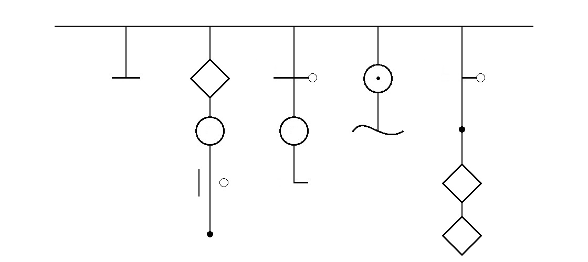
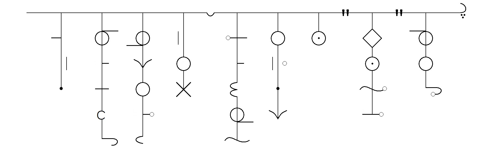

# 头饰体

## 样式

*i love you as well*

这个字体是设计了标点的

*the quick brown fox,jumps over a "lazy" dog???*

句末的问号确实是三个，有几个点儿就是几个问号。

## 灵感

来源至少有三个：

- 头饰：

就像是字体的名字，美感无需多言：

<a href="https://gd-hbimg.huaban.com/b3c70257769c9e91ab2b3bfce2ba82b1a31ea008208f10-Rfglvw_fw658webp" target="_blank">点击看图（外链）</a>
<a href="https://gd-hbimg.huaban.com/1343213c300815b2efe0965f9d1002f4f7eb05101ac92-JB3CFk_fw658webp" target="_blank">点击看图（外链）</a>

这两个是中式的，一个少数民族风格，一个是核心风格吧。西式的也有很多华丽的头饰，不需要图片也能很好说明。

- 历史上的文字：

有的文字好像不太适合贴出来（）总之，历史上确实有很多竖写的文字，其实古代时候中文就是竖写嘛~不过中文每个单词之间有缝隙，因为单词是有一个或者多个汉字组成的。也有音素文字是竖写的，而且每个单词内部链接，外部分离，最经典的就是满文。

不过不论是什么样的书写系统，单词和句子书写方向都是一致的，而这个字体意在打破这种限制————单词竖写，句子横写。

- 各种装饰品：

比如说风铃：
<a href="https://gd-hbimg.huaban.com/fbed0530a57559435a9f25d56f83930f1b55633b11142-md3wQ0_fw658webp" target="_blank">点击看图（外链）</a>
<a href="https://gd-hbimg.huaban.com/4caee45d7160b82e339926b74a897abb1839275757f4-1C0h3h_fw658webp" target="_blank">点击看图（外链）</a>
<a href="https://gd-hbimg.huaban.com/64f3c95341b8d1742624f5334db0f9c2f18102ac251de-LYiQNx_fw658webp" target="_blank">点击看图（外链）</a>

许愿签儿：
<a href="https://gd-hbimg.huaban.com/33f5d766b65efe6010b382fd10a3d5b9ae57351637817-ujBry1_fw658webp" target="_blank">点击看图（外链）</a>

捕梦网：
<a href="https://gd-hbimg.huaban.com/984a837c366754490d1f7442bb8065e9bbfdf13a1fa38-EImgvA_fw658webp" target="_blank">点击看图（外链）</a>

各种各种吧：
<a href="https://gd-hbimg.huaban.com/f897b0305dc7cb24d03bf15082043cf5f9d6e78812254-feDalG_fw658webp" target="_blank">点击看图（外链）</a>