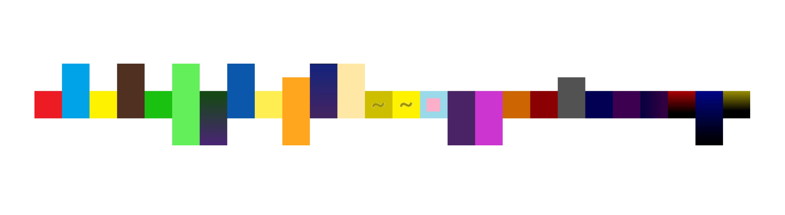

# 色彩体

## 样式

*abcdefghijklmnopqrstuvwxyz*

## 灵感

小时候一直觉得数字和字母都是有颜色的。比如说A就是红色的，B就是蓝色的，C是黄色的。

后来得知，这种感觉其实是被学者们注意过的，这种现象叫做“联觉”。

灵感就是，能不能放弃所有的弯弯绕绕，只使用心中的感觉，还有字母占地的大小，必要的时候使用一些指示符号（比如n和m使用了一个~形，其实是一个较为通用的鼻化符号），来表达一个字母？

看起来可以。