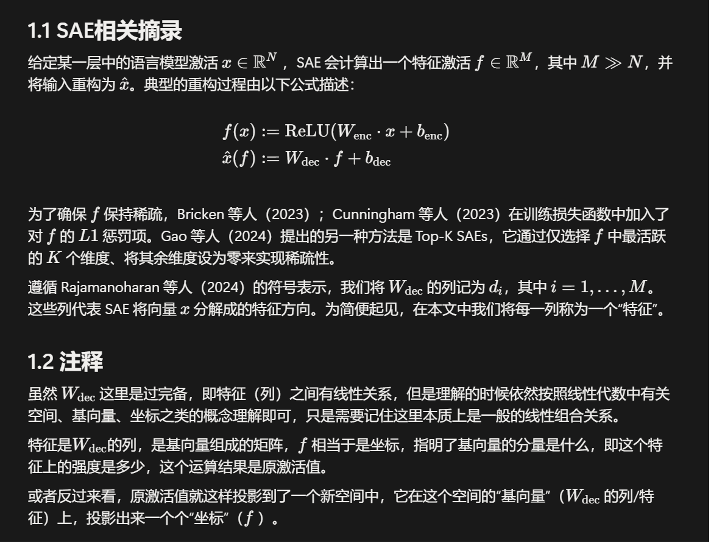
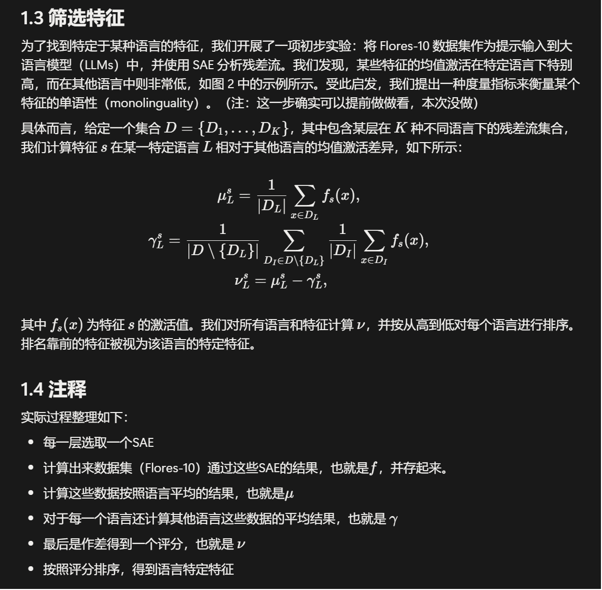

## Token Alignment via Character Matching for Subword Completion

[链接](https://aclanthology.org/2024.findings-acl.929.pdf)

要解决的是生成式、补全式模型遇到partial token的OOD问题，提出的方法甚至和模型本身如何如何没啥关系——就是往前回溯，保证能回溯到完整token即可，然后重新生成，对照着后面的它所谓的“对齐前缀”把不匹配的扔了，匹配的放上去并缩短“对齐前缀”。

这样子，回溯得过头的部分不会有影响，回溯得覆盖了partial token的部分，由于是按照完整token生成的，没有ood问题，且利用了partial token的信息。

## TokAlign: Efficient Vocabulary Adaptation via Token Alignment

[链接](https://aclanthology.org/2025.acl-long.207.pdf)

词表替换是个可能的操作，有很多目的，也许是为了增加压缩率，也许是为了token级蒸馏，也许是为了跨语言迁移。

本文要解决的，其实就是词表替换后的训练问题，分为初始化和训练的优化。对于前者，它的方法是用glove弄到两个词库的token的嵌入，然后初始化的token嵌入就是余弦相似度最接近的源token的嵌入，或者有一致的直接复用，然后按照这个一一映射初始化嵌入层和head层（其实是一种重排）。

对于后者，两步适应训练，第一步训练嵌入层和head层，让它适应这个词表，第二步全部参数继续训练。

## Bridging the Gap between Different Vocabularies for LLM Ensemble

要做一种token级别的集成学习。

除了其他集成学习常提到的好处，文章提到，由于早期错误会导致错误导致后续一系列错误（snowball），token级别生成过程集成学习，在每一步都削弱这件事。output级别的生成模型集成这一点比不上token级别。

为了达到token级别的生成模型集成学习，解决词库不一致（对齐）是第一步，文章做这一点似乎并没有太多创新，他得到Q到P转移矩阵UQP的方法，是优化转移前后，本来就重叠的token的嵌入的差距要越小越好，然而具体优化策略，还有最后词库的映射矩阵WQP，都用了其他已有几年的方法。

之后修WQP噪音，这是因为能够观察到一些问题，可以采取对应方法。例如，观察到，有无意义源token高相似度地对应到很多目的token，那么就可以把低方差多对应的砍掉。

最后，Q按照自己方法得到概率分布，用WQP映射到P的概率分布即可，这样不需要“挑一个”之类的，确实是在每个token的分布层次（“token级”）进行考虑。多个映射到p的概率分布，（用对极值不敏感的方法）综合一个结果即可。

## AlignDistil: Token-Level Language Model Alignment as Adaptive Policy Distillation

这个文章“对齐”的用法，是在说output和人类意图的对齐。

细粒度上进行考虑，output拆成token级别，人类意图经过理论推导变成定理1的公式，变成了每一步策略token分布和教师token分布的KL散度。教师策略的构造文章有很多考虑，是正反dpo（文章对此有非常多说法）和自己稳定性成分的logit的线性组合（该组合本身有参数可以训练，也就是他的自适应外推）。

之后那个公式每一步token生成，都给出了一个当前策略的反馈评估，使用蒙特卡洛强化学习算法就可以训练，所以文章有同策略异策略两种。但是数学细节我的没太看懂...

## 模型融合的两篇

LANGBRIDGE: Multilingual Reasoning Without Multilingual Supervision

和

MindMerger: Efficiently Boosting LLM Reasoning in non-English Languages

两篇有个继承关系，都是模型融合。LangBridge说，这个思路来自多模态领域，那里是用一个视觉编码器融合一个LM（MindMerger附录提到连接层/映射层一般是QFormer），这里就用一个多语言编码器融合一个推理力强的LM（LangBridge使用一个线性层，MindMerger使用两层）。这个编码器的输出作为LM的输入，所以可以看做是“soft prompt”，因为后面LM面对的直接就是“某些东西的嵌入/隐藏状态”而不是某个原本面貌。可训练内容只有这个映射层，还有一些作为标记的特殊向量，多语言编码器、LM都不冻结。

LM的面对的内容，MindMerger相比LangBridge，多拼接了input本身在LM上的嵌入，以及由此多了的第二个阶段的训练。这个设计是为了“激发LM内置的能力”。这样，MindMerger只对于本身具有一定多语言理解力的模型成立（不然后面的拼接就不成立了）。

实验的部分容易多了，关注推理能力，导致很多实验评估指标都是准确率。

核心的概念应该是语言中立（neutral或者agnostic），两个文章都把映射层结果/soft prompt降维（兼聚类，PCA或者tsne），各个语言它们倾向于混合在一起；不过直接看多语言LM的嵌入，语言之间就是分开的。

两个文章都用了的mT5，训练的时候，是随机掩码input的一段连续token，然后让模型恢复，是一种训练多语言能力的方法。

## LANGUAGE IMBALANCE DRIVEN REWARDING FOR MULTILINGUAL SELF-IMPROVING

说白了就是dpo微调，把模型用这种方法从一种语言调整到倾向另一种语言。文章主要在如何构造dpo数据上下了功夫，让语言不断执行翻译任务可以多构造出来一些数据，不断迭代下去逼近意图。

使用llama-factory框架，蛮方便的框架。

## 推理干预若干几篇

主要关注两篇文章，以及他们之前的相关工作。

首先是https://aclanthology.org/2025.acl-long.118.pdf

里面提到它依据的那种专家发现的方法，就是文章

https://openreview.net/pdf?id=2P6GVfSrfZ

这本身是这个团队在2024年对自己2022年一个工作的改进。

专家发现关注到语言模型的神经元（每个块FFN层的第一个线性层的输出）对于一些特定的concept起到类似分类器的作用，这个事情到底能不能成立，文章做了筛选和随机选的验证，确实成立。

文章的筛选方法是找到对于concept进行标注的数据集，对于每个输入token序列，记录模型每个神经元的待激活值，最后取这些值最大值（可以认为是用max完成对这些信息的聚集吧）作为对于concept的识别强度，配合标注向量，画PR曲线（ROC也可以），曲线下面积AP（AUROC也可以）最大的K个就是识别出来的专家。

之后他们把concept设置为有毒、歧视等等，想要削弱concept倾向。他们在2022年的方法，是把专家神经元输出换为0，效果不佳，后来发现是因为这个方法对于k敏感，总之依然不好用。2024年就变为比例削减了，对concept识别能力越大，乘以的削减系数越小，这个系数所以可以很好地选为1-Gini

当然也可以增强concept倾向，第一篇论文选择小语言作为concept，识别出来之后恒定把这些专家神经元输出维持在正输入进入时、那种高待激活值的平均值，认为这时候模型应该会更加偏向这种小语言的各种模式（因为这些小语言专家一直在输出高的值）。困惑度、准确度方面和前面论文表现一致。

第4章对于嵌入空间变化做了实验，所有语言变化到一个新嵌入空间，但是各个语言之间却更接近了。

接着第5章实验跨语言识别，检索准确率的提升被论文认为是第4章提到的“各语言嵌入空间更接近”导致的，但是文章又发现这种嵌入空间平均距离的减少和准确率的提升没有太强相关性......

之后比较神奇，由于所有语言嵌入空间都变近了，没有被干预的语言的检测能力也变强了，也就是说目标语言对齐能力变强了，其他语言的也变强了，这蛮神奇的（）文章这里多次提到一些反例，并归结为这和模型本身训练时候如何如何有关系。

第6章语言内部释义检索任务（paraphrase retrieval），第一个结论是通过top-1前后变化不大认为语言内部相似性依然保留，第二个结论相当于强化之前结论。第7章相当于看看是不是比随机选神经元好。

---

第二个论文经常和以下两个方法对比（还有和CAA结合一起使用的测试）

ITI：
https://papers.nips.cc/paper_files/paper/2023/file/81b8390039b7302c909cb769f8b6cd93-Paper-Conference.pdf

这个方法和专家发现有点像，但是这个是要发现注意力头，文章用真实性做例子。x角标l上标h“represents the value that the h-th attention head in layer l will contribute to the residual stream”（第l层第h个头对于残差的贡献），论文找了和真实性有关的数据集，一个个往里面放，记录每个注意力头的“x角标l上标h”，之后训练一个二分类器，这当作某种“探测器”，并且把这个二分类器的参数“θ角标l上标h”叫做真实性方向。之后他发现这些真实性方向构成一个空间，这个空间还是高维的。

之后开始干预，选择前k个评分最好的注意力头，干预强度alpha是超参数，要乘到评分时候的标准差上。之后是干预方向，文章说一开始说了有两个方法，后来实验的时候又选了三种，附录B也谈到这个事情，似乎这个事情目前有些细节还说不太清楚，但有一些猜想。超参数就是k和alpha。

不过第二个论文让他多输出英语，感觉对比意义不大。

CAA：
https://aclanthology.org/2024.acl-long.828.pdf

这个方法和这个论文更加接近一些，是构造steering vector（v_MD），推理的时候对一个层(4.1节实验选择出)的隐藏状态的每一个token位置加上。构造方法是，用一个设计好的数据集（末尾是A和B表示偏好）输入模型，在L层得到最后一个token的隐藏状态，相减，然后平均。

第二个论文也让学一个非英语到英语的v_MD，感觉对比也意义不大，我总感觉ITI和CAA的设计都不方便增加对于多语言的能力。。。

第二个论文的方法，考虑小语言和英语的翻译对儿，对于每一层，分别拿到最后的隐藏状态，学一个转移矩阵使得小语言转移后和英语距离最小，最小二乘问题可以直接求不用学。以后输入一个小语言，每一层可以得到一个，相应的最后隐藏状态的转移，乘一个参数alpha加到最后的隐藏状态，这样就把英语的额外指导信息加进来了。这里和CAA不一样，CAA在少数层做，这里所有层都有；CAA隐藏状态矩阵每一行都加偏移，这里只加最后一行。

我觉得之后的分析和讨论都没有太特别的，除了第5章最后一段：有些语言的alpha居然是负值会更好，直观看就是不仅是不要英语的指导会更好，甚至是反向指导会更好。

---

总结来说，这里面四个方法，可以看做两个类型：

1. 两个方法（专家神经元、ITI）是发现模型中一些特别结构，这些结构对于某类信息更加敏感（例如表现为分类器的功能 专家神经元，或者可以构造probe去探测出来特点 ITI），然后喂数据去发现它们，增强它们。

2. 另外两个方法（INCLINE和CAA）是对隐藏状态做干预，对于（某一层或者很多层的）隐藏状态矩阵（每一行或者最后一行）加上一些额外信息，这些信息通常是小语言和英语（的数据集）通过模型时候，记录这些隐藏状态的差异得到的，不过这个差异具体怎么做会不一样（直接作差CAA、找转移矩阵INCLINE）

## 多语言模型的机制可解释性

Do Llamas Work in English? On the Latent Language of Multilingual Transformers

Separating Tongue from Thought: Activation Patching Reveals Language-Agnostic Concept Representations in Transformers

多语言模型很有可能用靠前的层进行语义理解，在中层，用接近英语嵌入的方式进行概念的整理，在末尾层，输出到目标语言上。语言模型具有语言无关的概念表示。

## SAE与基于SAE的干预

SAE，稀疏自编码器，机制可解释性领域的一种好方法。神经元这种东西携带了太多含义了，人们开始在层与层之间加入一个十分稀疏的空间，隐藏状态被映射到这个稀疏空间中，期望这个新空间上含义能够分离开，然后映射回来——这个过程就是SAE模型。它需要单独训练，没有通用性，但是一旦训练好，人们就可以过数据寻找稀疏空间上什么分量取值特别高，这就是这些数据具有的那些特征体现在数据上的样子。

https://aclanthology.org/2025.acl-long.1536.pdf

中的核心概念整理如下：

那么就可以寻找到语言特定的那些特征了，语言无关的特征也可以找到，之后就可以做干预。

