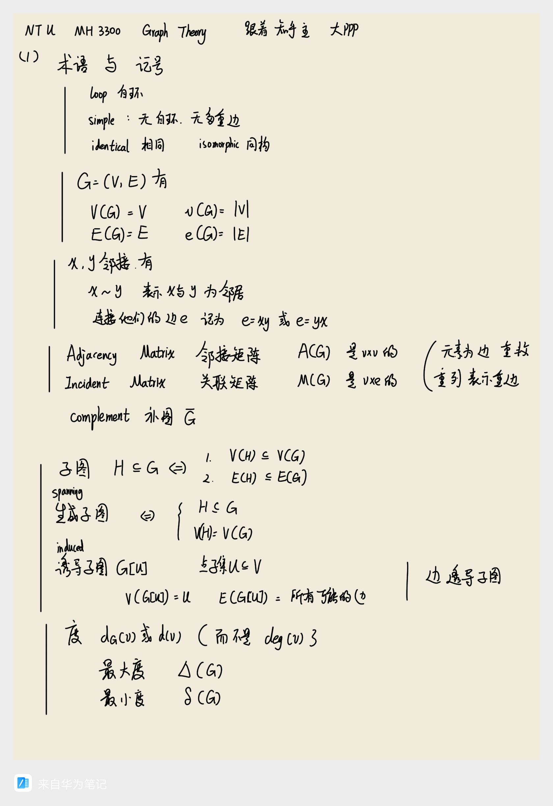
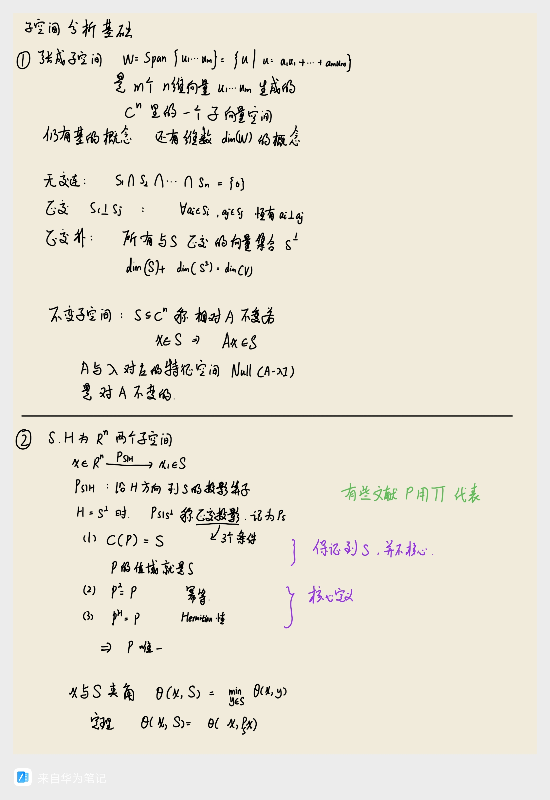
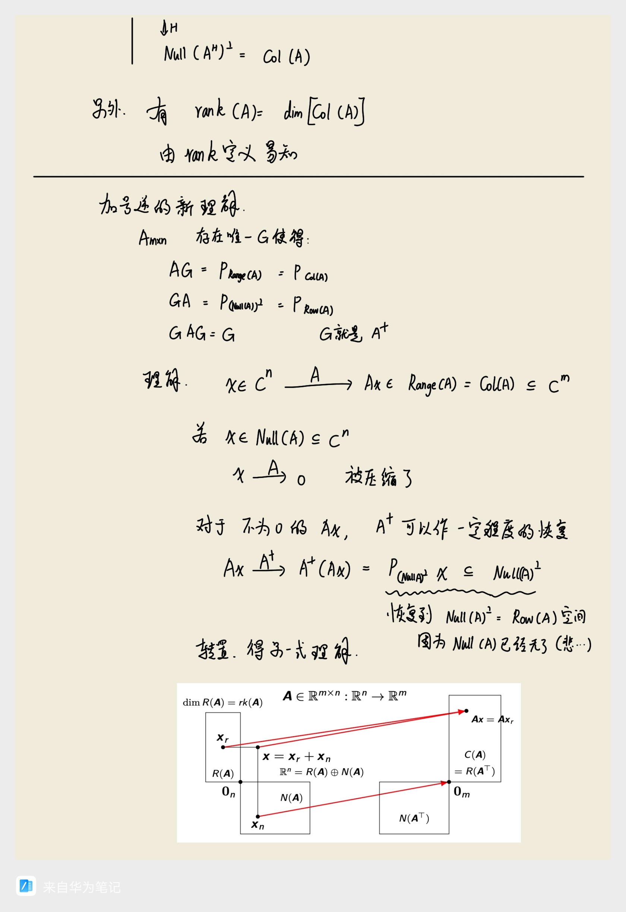

# 图数据挖掘的数学基础

本页面介绍当时了解图数据挖掘、图神经网络/GNN时，学习到的一些数学知识。可能不完全适合初学者。
资料来源比较多，详情见下文。

## 1.图论进阶

### 1.1记号与拉普拉斯矩阵

这里主要参考了：

1. 知乎一个用户的学习笔记[NTU MH3300学习笔记](https://zhuanlan.zhihu.com/p/660468990)
2. 知乎专栏AlgorithmicRUC的谱图理论部分，[AlgorithmicRUC](https://www.zhihu.com/column/c_1022440593678594048)
3. 少部分参考了 Reinhard Diestel 的 Graph Theory 第五版，西安电子科技大学提供了链接，[Graph Theory 第五版](https://web.xidian.edu.cn/zhangxin/files/20020101_111456.pdf)

以下两页主要介绍了一些记号，带出部分定理。

这一页引入图的拉普拉斯矩阵，理解这个东西就像是二阶导数，或者说二阶差分，体现了周围点的值相对于中心这个点的差异。就是说，我们定义一个函数 $f$ ，从图上的节点映射到实数。那么，拉普拉斯矩阵 $L=D-W$ ，作用到函数值拼合成的向量 $\textbf{f}$ ，得到的 $L\textbf{f}=(D-W)\textbf{f}$ ，就是这些节点函数值“二阶导数” $\Delta f_i$ 拼合出的向量，而所谓节点函数值“二阶导数”，说的是每一对儿 $(f(相邻节点)-f(本节点))$ 的和。

这一页介绍关于$L$的几个性质。右侧的子空间分析后文有详解。

这个性质给出了谱布局，这是一个图绘制领域的经典方法，也就是networkx的那句pos=nx.spectral_layout(G)用到的布局。其中这一个定理的证明，参考《矩阵分析与应用》(张贤达)的529页。

之后两页是谱的估计，这其实是蛮复杂的话题，这里只是最基本的结论。谱，说的就是拉普拉斯矩阵的特征值，至于为什么这么命名，其实是比较深奥的事情，数学和物理很多领域都出现了“谱”，大致可以认为这个术语来自“光谱”，光谱就像是乐谱一样展开，有很多值，而这些值，或者其中一些特别的值，代表了事物的某些深刻的特征。

后文会理解其中两个联系，一个是傅里叶变换的角度，一个是调和性的角度。另外，对于矩阵的特征值的深入研究，叫做特征分析，同时也叫作谱分析，所谓矩阵的谱就是这个矩阵特征值的集合，这可能是理解谱这个字眼最简单的方法，

### 1.2谱分割

主要参考了国外一个大学（宾夕法尼亚大学工程与应用科学学院）的PPT：[Graph Clustering and
Image Segmentation](https://www.seas.upenn.edu/~cis580/lectures/580ncut.pdf)。其中广义瑞利商的理解还是参见《矩阵分析与应用》。

## 2.拉普拉斯矩阵与图谱的物理理解

这部分知识不成体系，是综合参考了互联网散落的资料，和AI。

### 2.1图的傅里叶变换

首先介绍一般的傅里叶变换。

然后是图的傅里叶变换。核心是这里指出，图上函数也可以拆解，只不过拆解出来的不是正弦和或者积分，而是谱基的和。我会单开一个文章介绍谱基怎么就能和高频低频、局部全局等问题联系起来。

### 2.2图的扩散模型

提到周围的值和自己的值的差距这一点，其实容易让人想到气体扩散和热传导，图上也可以做扩散。

### 2.3与调和性/和谐性有关

能够联想到调和性/和谐性，是因为提到二阶导数，以及由此联想到的调和函数/调和场，还有调和方程/拉普拉斯方程。调和性说的是某种“平衡、和谐、无内部源的平滑变化​​”，体现在物理上具体的某一个场会有具体的更多性质。数学上，调和函数/调和场，指的是满足拉普拉斯方程（也叫调和方程）的多元函数/场。拉普拉斯方程一般使用拉普拉斯算子 $Delta$ 表达，它是函数对于各个自变量的二阶导数的累积（注意这里又出现了二阶导数），对于二元函数/二维场：
	
$\Delta u = \frac{\partial^2 u}{\partial x^2}$

对于三元函数/三维场：

$\Delta u = \frac{\partial^2 u}{\partial x^2} + \frac{\partial^2 u}{\partial y^2} + \frac{\partial^2 u}{\partial z^2}$

不论何种情况，拉普拉斯方程，说的是：

$\Delta u = 0$

之所以把图论的那个奇妙矩阵叫做拉普拉斯矩阵，就是这个原因了。

图也有调和性的定义。有些系统，其稳定状态，正是调和的，而它们其中一些又可以用图论建模。具体细节还是挺复杂的，请参考[读书报告 | 谱图理论 Ch11: Walks, Springs, and Resistor Networks](https://zhuanlan.zhihu.com/p/558228174)和[读书报告 | 谱图理论 Ch12: Effective Resistance and Schur Complements](https://zhuanlan.zhihu.com/p/560665724)的讲解。

## 3.其他数学知识

### 3.1一些代数技巧

### 3.2子空间分析

这一部分资料来源主要是《矩阵分析与应用》其中一章的前几节，少部分参考网络。

