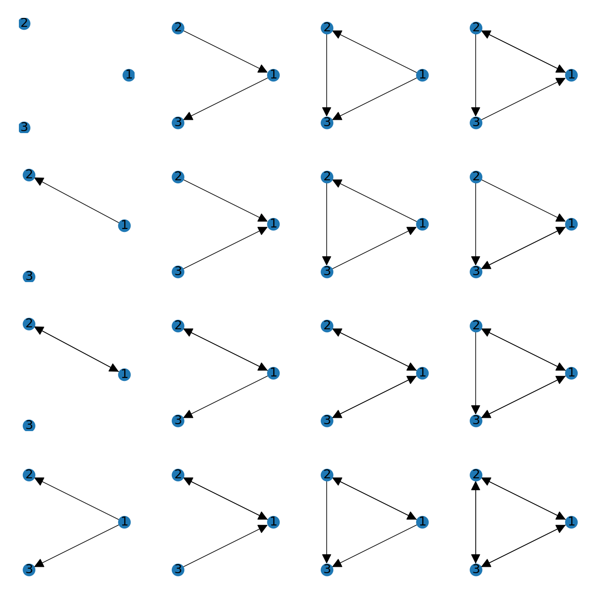
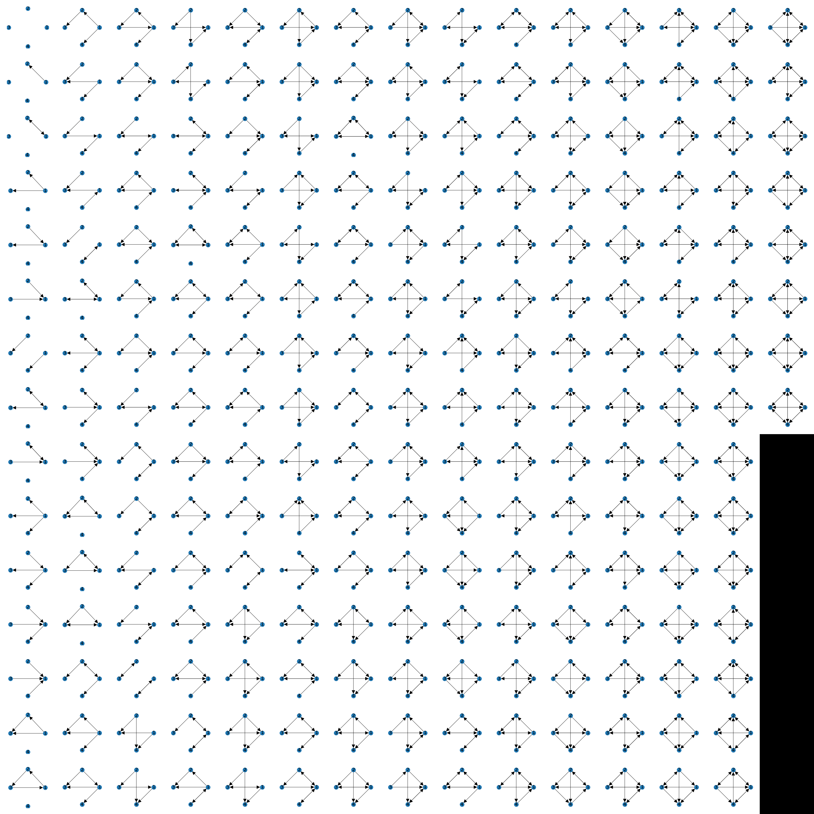
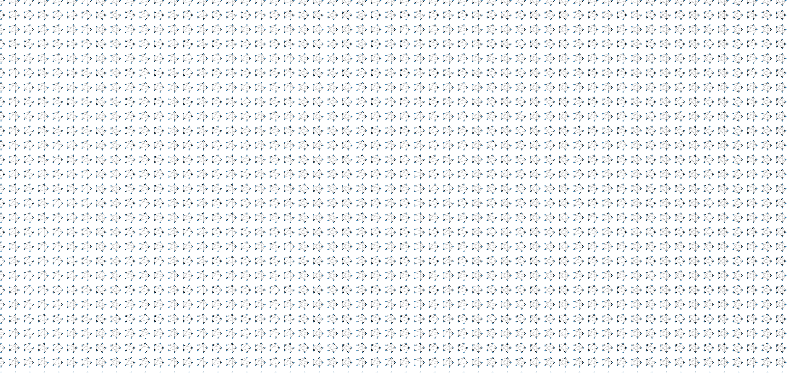
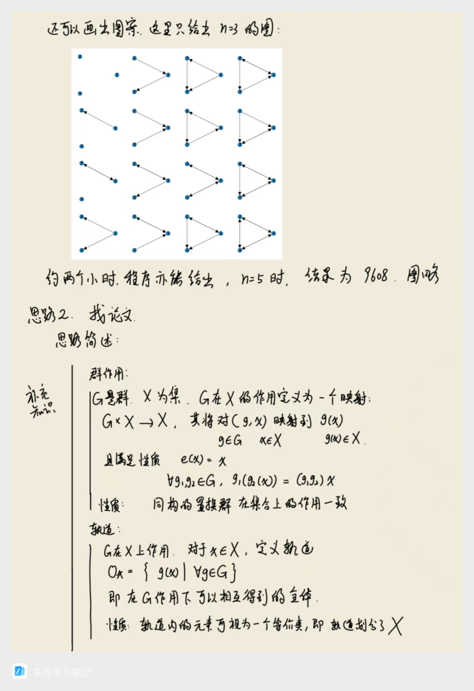
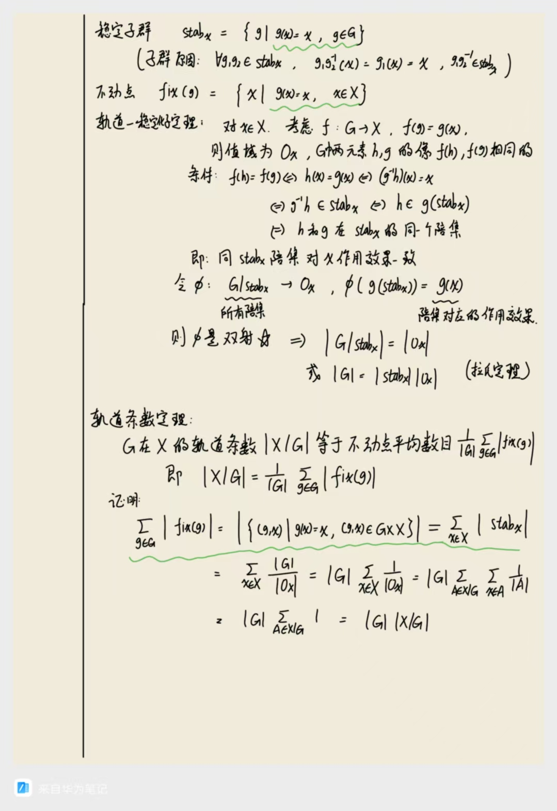
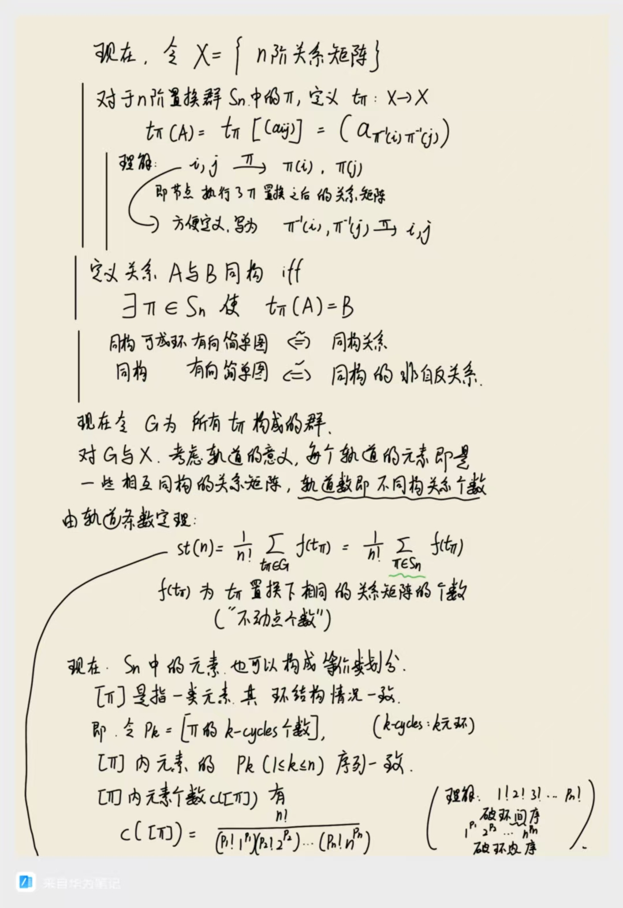
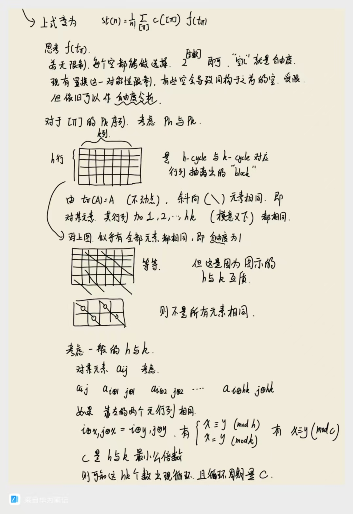
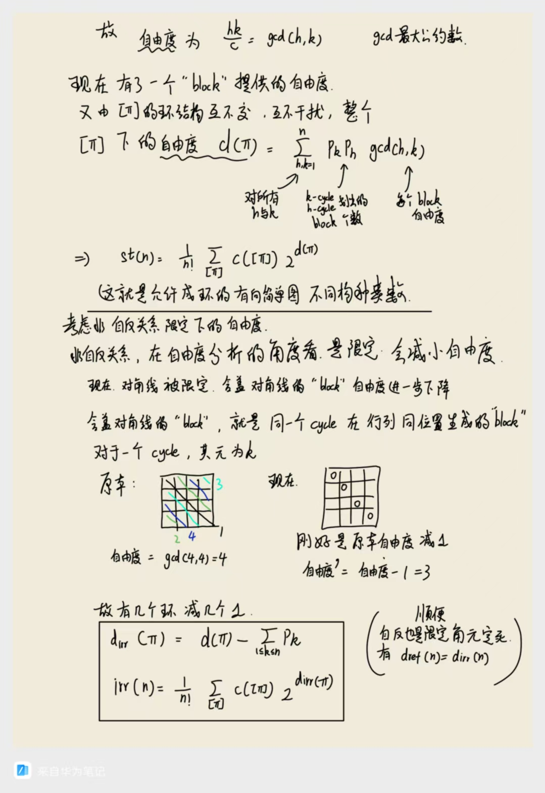

# 不同构的简单有向图

起因是一个离散数学作业题：

> How many nonisomorphic directed simple graphs are there with n vertices, when n is 2,3,or 4?

## 暴力破解

我还是不贴这个一点没有美感的代码了。

总之最后算出来直到$n=5$并且可视化，还是有点壮观的：

*这是 n=3 的情况，共有16种不同构的简单有向图*

*这是 n=4 的情况，共有218种不同构的简单有向图*

*这是 n=5 的...一小部分情况，因为共有9608种不同构的简单有向图！*

## 一个论文

不过呢有了这几个结果显然已经可以去OEIS上查了，在这里：[A000273](https://oeis.org/A000273)

顺势找到一个论文，是从关系的角度等价地考虑：

[The number of structures of finite relations ----by Robert L. Davis](https://www.ams.org/journals/proc/1953-004-03/S0002-9939-1953-0055294-2/)

这个东西...有点晦涩，但是勉强看懂了，花了不少时间，当时的笔记如下：

