# 继续谈图的傅里叶变换

## 1.基本观点
上一篇文字[图数据挖掘的数学基础](../maths/图数据挖掘的数学基础.md)，在讲解了2.1介绍了傅里叶变换和图的傅里叶变换。那一节的最后一张图意义很关键：

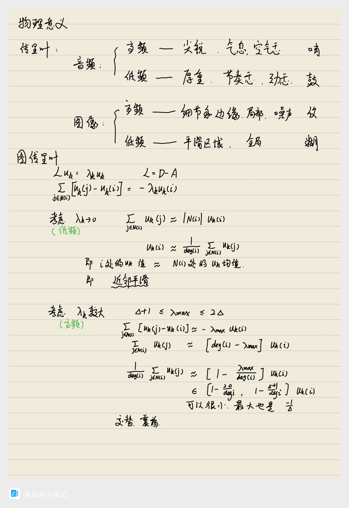

时间和空间在这里看做是一个东西，如果研究的是音频，可以认为取值在时间上延展，叫做时域，而如果研究的是图像，取值在空间上延展，叫做什么我也不知道，不重要，总之，原来的函数值是在时空中延展的。傅里叶变换，就是要把这个延展体拿出来，考察它的“频率”，表达频率的最好的东西就是一个个正弦波，我们要看的，就是这个图多大程度地叠合了一些低频的波，又多大程度地叠合了一些高频的波，这就是频域。

对于音频和图像，高低频因素代表的意义，就是图片中总结的那样。

对于图上的取值，我们依然有类似的理解，只不过这次我们不是在欧氏空间延展函数值了，而是在一个节点空间。这时候，正弦波就变成了谱基。这是一件很神奇的事情，图片中，我们使用数学理解了谱基的取值特点，指出，低频的谱基（比较小的特征值对应的特征向量），其每一个点上的取值，倾向于和周围点的取值的平均值一致，而高频的谱基（比较大的特征值对应的特征向量），其每一个点上的取值，倾向于和周围点的取值的差异较大，甚至呈现出取负号的特点。这几乎就是在说，低频谱基不爱振动，频率低，高频谱基爱振动，频率高。

## 2.直观看音频和图像的傅里叶变换

### 2.1 音频的傅里叶变换

先看音频，Python导入WAV文件可以这样：

```python
import numpy as np
import scipy.io.wavfile as wav

sample_rate, audio_data = wav.read('文件名.wav')
length = audio_data.shape[0]

print('seconds:',length/sample_rate)
print(sample_rate,length)
```

写回文件的时候这样：

```python
wav.write('filtered_audio_highpass.wav', sample_rate, ifft_result_highpass.astype(np.int16))
wav.write('filtered_audio_lowpass.wav', sample_rate, ifft_result_lowpass.astype(np.int16))
```

MP3其实也是可以的：

```python
import numpy as np
import librosa

audio_data, sample_rate = librosa.load('文件名.mp3')
length = audio_data.shape[0]

print('seconds:',length/sample_rate)
print(sample_rate,length)
```

写回文件的时候这样：

```python
import soundfile as sf
sf.write('filtered_audio_highpass.wav', ifft_result_highpass, sample_rate)
sf.write('filtered_audio_lowpass.wav', ifft_result_lowpass, sample_rate)
```

双声道好像有点问题，所以素材最好准备为单声道。我这里演示用的素材是一段人声：

<audio controls>
  <source src="../img/图的傅里叶变换/人声测试.wav" type="audio/wav">
  您的浏览器不支持音频播放。
</audio>

numpy有方便的代码可以帮我们办到傅里叶分解：

```python
# 进行傅里叶变换
fft_result = np.fft.fft(audio_data)
fft_freq = np.fft.fftfreq(length, 1 / sample_rate)  # 对应的频率向量

# 只取前半部分频率，因为后半部分是对称的（对于实数信号）
half_n = len(fft_result) // 2
fft_result_half = fft_result[:half_n]
fft_freq_half = fft_freq[:half_n]
```

这里为什么还有对称的负半轴的频率，先不解释了，和数学细节有关系。

这里画个图，便于理解：

```python
from matplotlib import pyplot as plt
plt.figure(figsize=(12, 12))

plt.subplot(2, 1, 1)
plt.ylim(-30000, 30000)
plt.plot(np.arange(length), audio_data)

plt.subplot(2, 1, 2)
plt.plot(fft_freq_half, np.abs(fft_result_half))
```

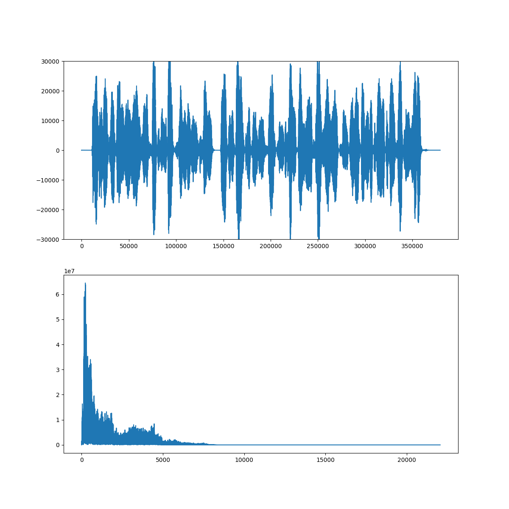

之后就是对音频进行处理， 最简单的，就是按照某个频率，把高频和低频分开，就得到了高通版本和低通版本，也就是分别做了高通滤波和低通滤波。

```python
# 滤波
# 选取omega_index 我用的是找频域最高值所在的位置 然后人工调一调：
omega_index = np.argmax(np.abs(fft_result_half))
omega_index *= 6  # 我发现这个位置效果会好一些
omega_index = int(1*omega_index)

fft_result_highpass = fft_result.copy()
fft_result_highpass[:omega_index] = 0
fft_result_highpass[-omega_index:] = 0

fft_result_lowpass = fft_result.copy()
fft_result_lowpass[omega_index:-omega_index] = 0
```

之后就是变换回来；

```python
# 进行逆傅里叶变换
ifft_result_highpass = np.fft.ifft(fft_result_highpass)
ifft_result_highpass = np.real(ifft_result_highpass)
ifft_result_lowpass = np.fft.ifft(fft_result_lowpass)
ifft_result_lowpass = np.real(ifft_result_lowpass)
```

最后使用前面提到的写回代码就可以生成两个文件了。这是高频版本，失真播报音：

<audio controls>
  <source src="../img/图的傅里叶变换/人声测试_highpass.wav" type="audio/wav">
  您的浏览器不支持音频播放。
</audio>

这是低频版本，好像变成大舌头了：

<audio controls>
  <source src="../img/图的傅里叶变换/人声测试_lowpass.wav" type="audio/wav">
  您的浏览器不支持音频播放。
</audio>

我这里还有一首好听的MP3格式的歌曲《Abel Korzeniowski - Dance For Me Wallis》：

<audio controls>
  <source src="../img/图的傅里叶变换/Abel Korzeniowski - Dance For Me Wallis.mp3" type="audio/mp3">
  您的浏览器不支持音频播放。
</audio>

这是高频版本，声音非常空灵跳跃：

<audio controls>
  <source src="../img/图的傅里叶变换/filtered_audio_highpass.wav" type="audio/wav">
  您的浏览器不支持音频播放。
</audio>

这是低频版本，声音非常厚重雄浑：

<audio controls>
  <source src="../img/图的傅里叶变换/filtered_audio_lowpass.wav" type="audio/wav">
  您的浏览器不支持音频播放。
</audio>


### 2.2 图片的傅里叶变换

这里我不多讲了，有一个很好的视频讲这个事情，[图像处理_傅里叶变换](https://www.bilibili.com/video/BV1vseMebEo3/)。

简单地说，图像的频域，是一个平面。平面上的点，现在不仅仅是代表着频率了（频率由其相对于中心点的距离代表），还代表着一个正弦波面。这个点的取值现在代表的是这个波的成分有多少了。

另外，视频还提到了相位的问题，这一点我之前一直没有细说。不论是图片还是音频，其频域的取值，我们之前通俗地说，就是其代表的波的成分强度，其实，这个数值并不是实数，而是复数，这样，其模长代表了这个波的成分强度，辐角代表了这个波的相位。

有方便的代码实现这个事情：

```python
import numpy as np
from numpy.fft import fft2, ifft2
import matplotlib.pyplot as plt

# 读取图像，然后黑白化
image = plt.imread('background_person.png').astype(float)
image = image[:,:,:3]
image = np.mean(image, axis=2).astype(float)

# 步骤1：傅里叶变换
F = fft2(image)
F_shifted = np.fft.fftshift(F)  # 将零频率分量移到中心

# 步骤2：频域低通滤波
# 设计低通滤波器（半径为D的圆形窗口）
D = 15  # 人工根据图像大小调整
rows, cols = image.shape
lowpass = np.zeros((rows, cols), dtype=np.complex_)
for i in range(rows):
    for j in range(cols):
        if (i-rows/2)**2 + (j-cols/2)**2 <= D**2:
            lowpass[i, j] = 1

# 应用滤波器，得到圆形低频频域
F_filtered = F_shifted * lowpass
F_filtered = np.fft.ifftshift(F_filtered)

# 步骤3：逆傅里叶变换
background = np.real(ifft2(F_filtered))

# 步骤4：提取另一部分
person = image - background

# 显示结果
plt.figure(figsize=(12, 6))
plt.subplot(1, 3, 1), plt.imshow(image, cmap='gray')
plt.title('Original Image')
plt.subplot(1, 3, 2), plt.imshow(background, cmap='gray')
plt.title('Lowpass')
plt.subplot(1, 3, 3), plt.imshow(person, cmap='gray')
plt.title('Highpass')
plt.show()
```

使用那著名的图片，我们有这个结果：

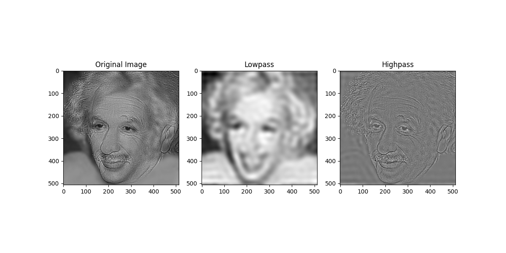
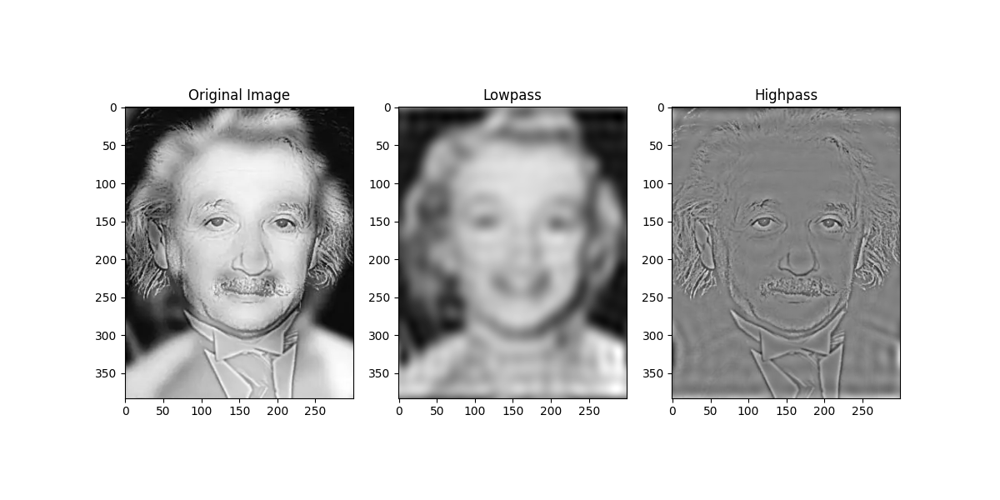

这是正常人像的结果：

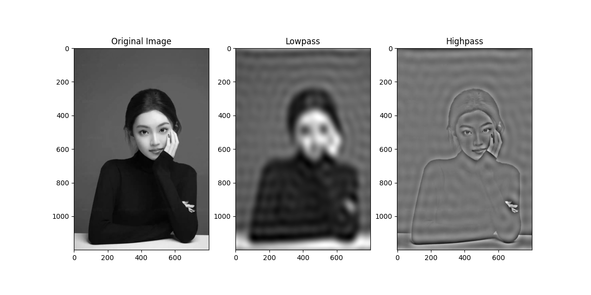
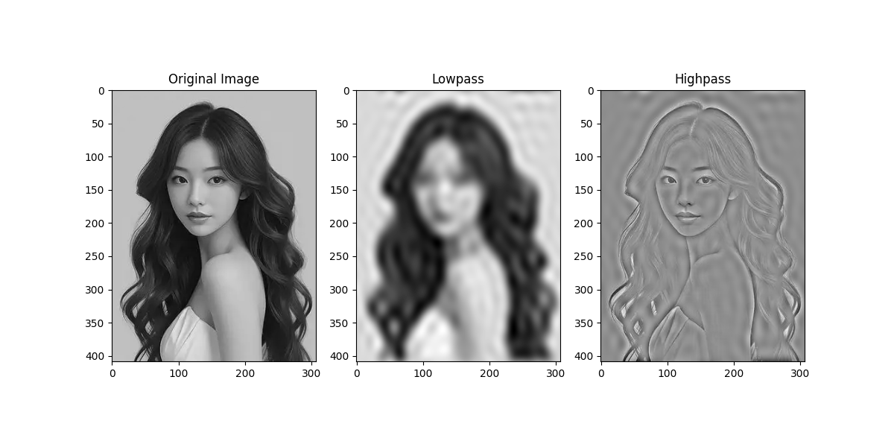

可以看到，低通的模糊，反映了全局不爱变化的信息，倾向于是背景信息；高通的尖锐，反映了局部边缘剧烈变化的信息。


## 3.图的谱基是什么样子

要理解的是，时间也好空间也罢，总之是时空上一个一个，或者一格一格延展出来的东西，他们的基，我们知道，就是正弦波。所以，前面的理解中，我们可以给这些直线也好网格也罢，实际添加上一些函数值，形成音频或者图片，给大家去看，我们只要高频波是什么样子，只要低频波是什么样子。这都是建立在我们已经对于正弦波形成了良好的直觉。

但是图不一样。图的基，和正弦波有相似，但是归纳不出来什么总体的模式。不同图表现出不同的谱基的特点，但是大致上依然有低频的谱基不爱变化，高频的谱基乐于跳跃这个特点。

为了建立这个直觉，我们先看链状图，这和音频的语境很像。之后的代码和这个都很像：

```python
import numpy as np
import matplotlib.pyplot as plt
import networkx as nx

# 建立需要的图
n = 20
G = nx.Graph()
G.add_nodes_from(range(1, n+1))
for i in range(1, n):
    G.add_edge(i, i+1)
print(G.edges)

# 拉普拉斯矩阵及其特征分解
L = nx.laplacian_matrix(G).todense()
print(L)

eigenvalues, eigenvectors = np.linalg.eigh(L)

print(eigenvalues)

# 画图
plt.figure(figsize=(8, 16))
n_display = n
for i in range(1,n_display+1):
    plt.subplot(n_display, 1, i)
    plt.plot(np.arange(n)+1, eigenvectors[:,-i])
    plt.title(f'{i}-max base vector')
plt.show()
```

最后的结果是这样：

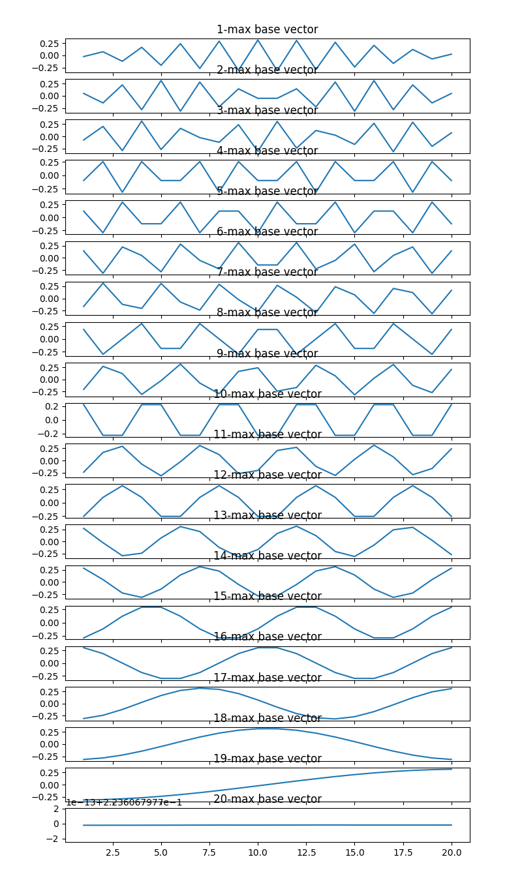

可以看到神似正弦波。

更像的，就是圈图，加上G.add_edge(n, 1)即可。圆和无限长直线，是一个东西：

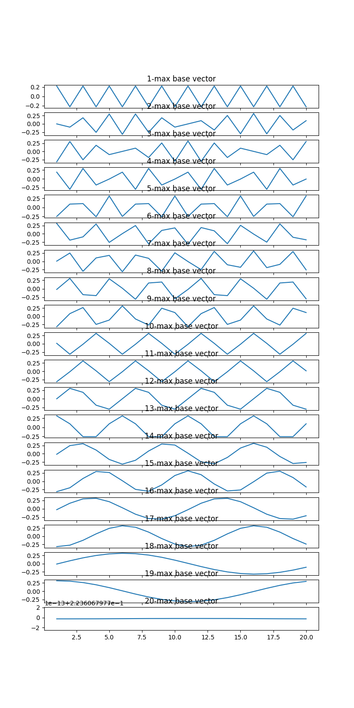

下一个直觉是网格图，networkx内置了grid_2d_graph，至于画图，可以这样：

```python
import numpy as np
import matplotlib.pyplot as plt
import networkx as nx

G = nx.grid_2d_graph(5, 5)
n = G.order()

L = nx.laplacian_matrix(G).todense()
eigenvalues, eigenvectors = np.linalg.eigh(L)

n_display = n
fig = plt.figure(figsize=(5, 5*n_display))

dataX = [x for x, y in G.nodes()]
dataY = [y for x, y in G.nodes()]

for i in range(1,n_display+1):
    ax = fig.add_subplot(n_display, 1, i, projection='3d')
    plt.title(f'{i}-max base vector')

    u2z = {}
    for idx, u in enumerate(G.nodes()):
        u2z[u] = eigenvectors[idx, -i]

    ax.scatter(dataX, dataY, [u2z[u] for u in G.nodes()], c='r', marker='o')

    for u, v in G.edges():
        ax.plot([u[0], v[0]], [u[1], v[1]], [u2z[u], u2z[v]], color='b')

plt.show()
```

我对结果PS了一下：

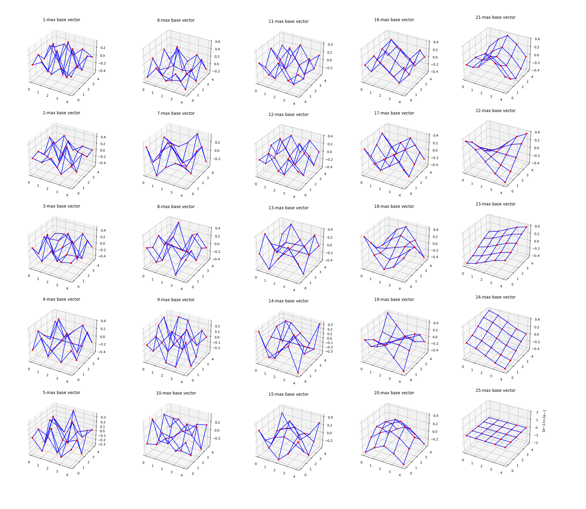

希望大家能够理解这里的精髓，由于其他图不容易可视化，我就不做了。有一个例子发挥想象力也算是可视化了，就是仿照二分图，我们搞一个三分图，所谓K6,10,6：

```python
n = 22
G = nx.Graph()
G.add_nodes_from(range(1,n+1))
for i in range(1,7):
    for j in range(7, 17):
        G.add_edge(i,j)
for j in range(7, 17):
    for k in range(17, n+1):
        G.add_edge(j,k)
```

记住，结果的横坐标不代表点实际的排布位置了，而是节点的编号：

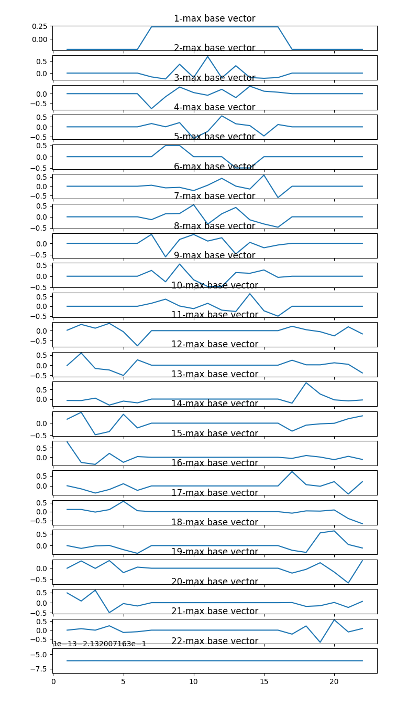

再来一个不太对称的，K6,9,7：

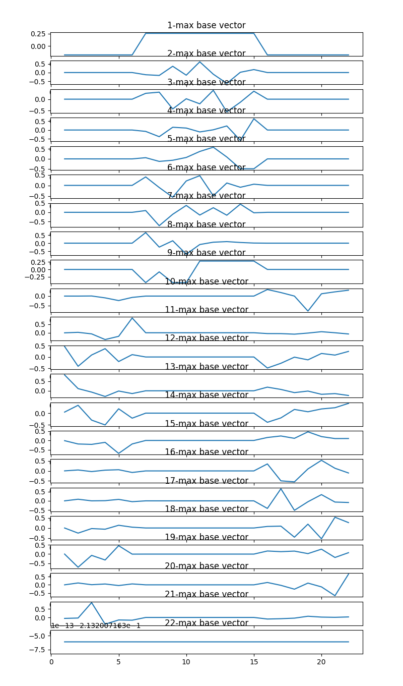

看看这个图片，真是具有美感，但也诡异，有时候，连续的两个谱基出现了一种“只好如此，凑活凑活吧”的对称，或者镜像或者点对称。之所以说“凑活”，是因为，我们知道，其实它们的振动频率不一样，但是上帝依然尽力让它们呈现出对称性。诗意地说，如果上帝真是完美无瑕，难道我们在用某些精妙复杂的、以至于某些高级存在也拿捏不了的设计，说明上帝真偷懒了，流溢出了德谬歌创造了这一部分的数学吗...
