简要介绍情况，很久之后再整理的，以至于主要参考了当时的报告进行整理。

新能源汽车数据开放平台可以拿到上海汽车博览公园东门停车场4.29-5.2四天的监控数据，前两天是工作日，后两天是节假日。

把所有这些数据的地理位置拿出来，暂时不管其他字段，画出来，可以看到数据的地理位置分布。

还可以贴合到高德地图的截屏中，那么就可以做一下空间的划分、道路长度的测定：

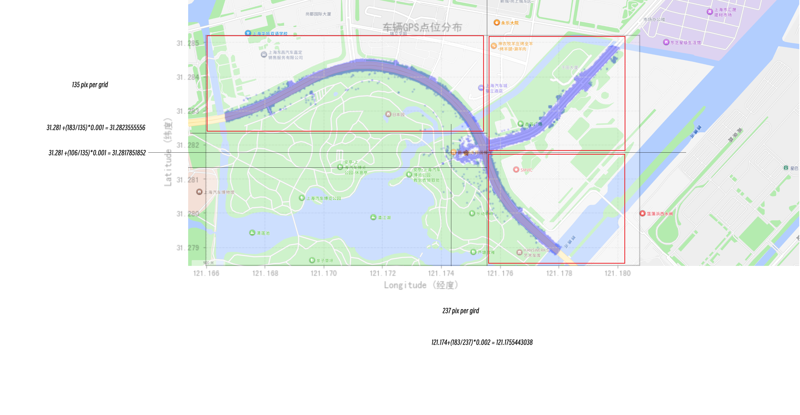

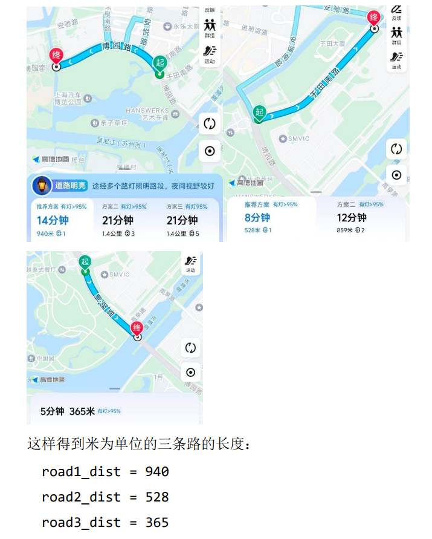

把数据事件化，即把不分时段的信息整理为“停入”和“离开”的一条完整事件记录，所谓的事件就是一次“停入”和“离开”，有多次进入离开的就有多条，可以直接统计进入/离开次
数、滞留时间、时间分布等。

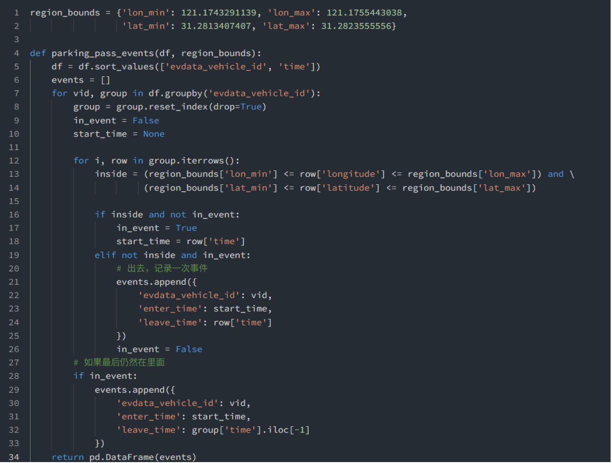

还应经过过滤，保留时长大于120秒的。也就是说，排除那些经过而不停车的：

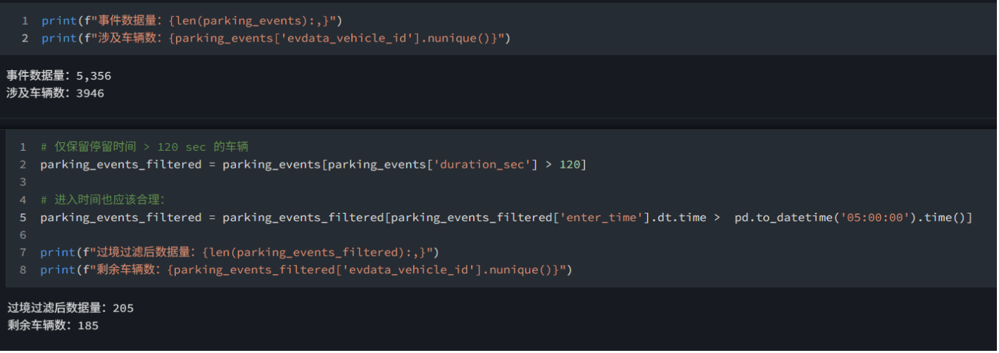

这个量级是合理的，高德地图网友指出实际上这地方只有60个车位：

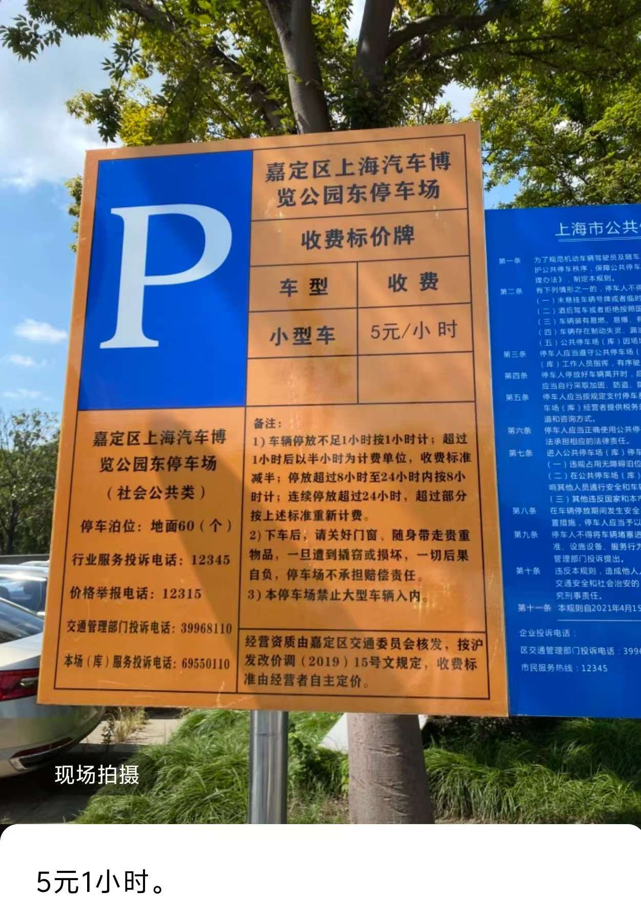

有这样的分析：

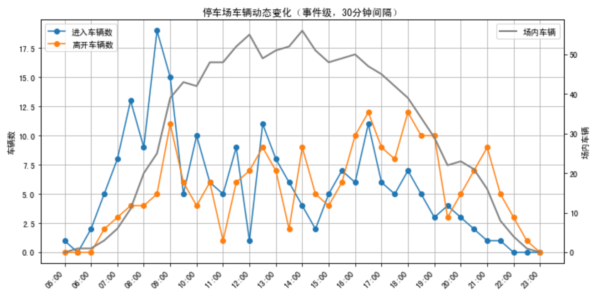

周围三条道路也可以考察，利用下面的指标：

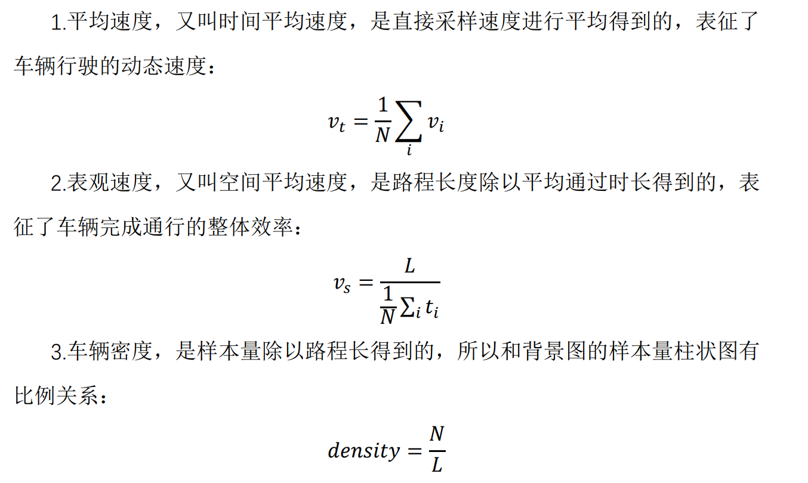

平均速度和车辆密度体现了司机的体感舒适性（以下数据中，凌晨的数据价值不大）：

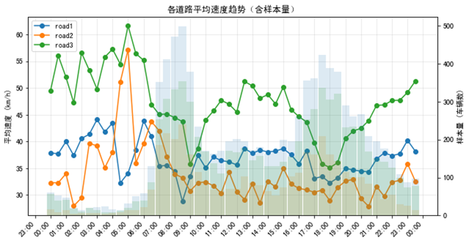

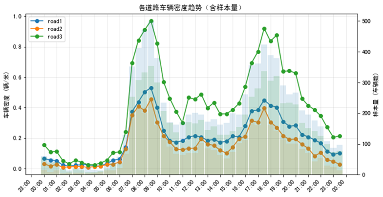

不考虑司机目的地，从尽快离开停车场（同时间距离越远越好）来看，应该考察表观速度，选择西北道路（road1）一般略优于其他道路，上午十点之前，东北道路（road2）略优于东南道路（road3），之后则是反过来。呈现“1、3、2”的顺序：

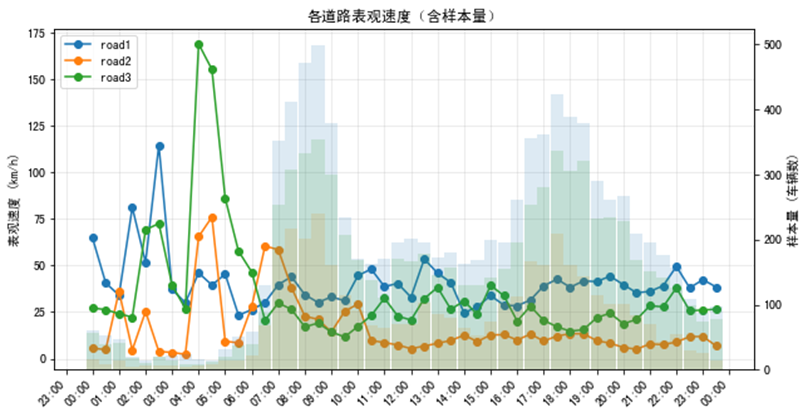

额外画出平均通过时间。不考虑司机目的地，从尽快离开该街区（离开街区用时越短越好），来看，应该考察平均通过时间，上午十点前各道路差异不大，在这之后，东北道路（road2）一般劣于其他道路，东南道路（road3）略优于西北道路（road1）。呈现“3、1、2”的顺序：

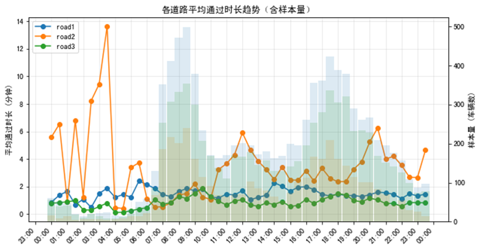

还可分析停车场内数量和其它各个量的关系系数：

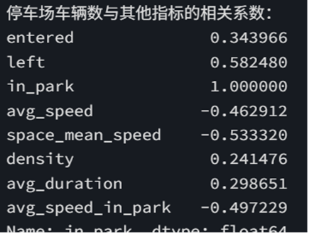

也就是说，场内数量和三条道路的平均速度、表观速度呈现明显的负相关，和道路密度、平均经过时间呈现一定程度的正相关；场内数量也和车的平均速度呈现明显的负相关。

现在看一下四日整体的图标，不单独分析每日了：

本结果表明，后两日各道路车辆密度都少于前两日：

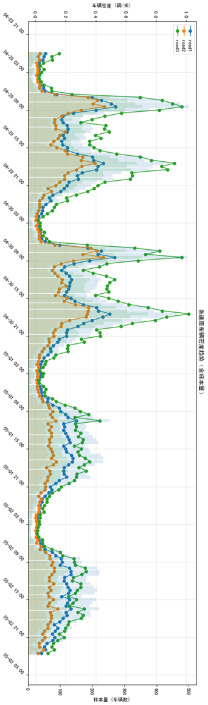

本结果表明，后两日停车场的车辆服务量少于前两日，但午间时段依然会短暂达到相似的场内数量：

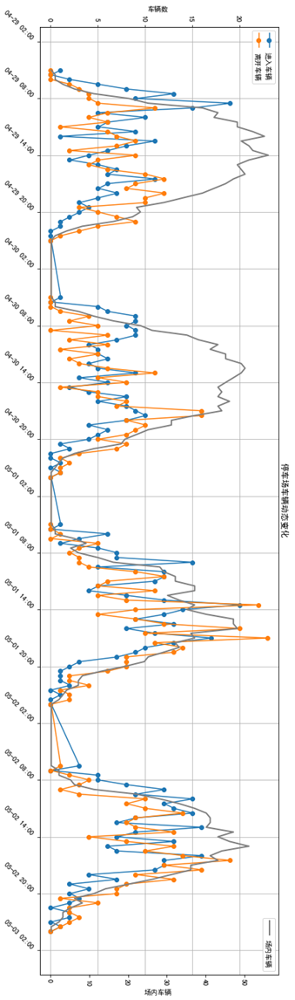

本结果表明，后两日各道路平均通过时长小于前两日，尤其是东北道路（road2）不再出现显著的尖峰（这通常意味着堵车）：

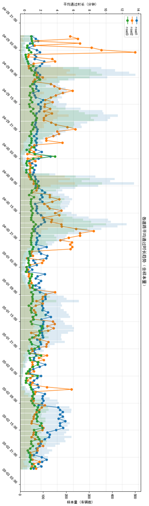

本结果表明，前两日表现尤其不好的道路（road2）在后两日有明显提升，表现出各个道路表观速度差异不大的趋势：

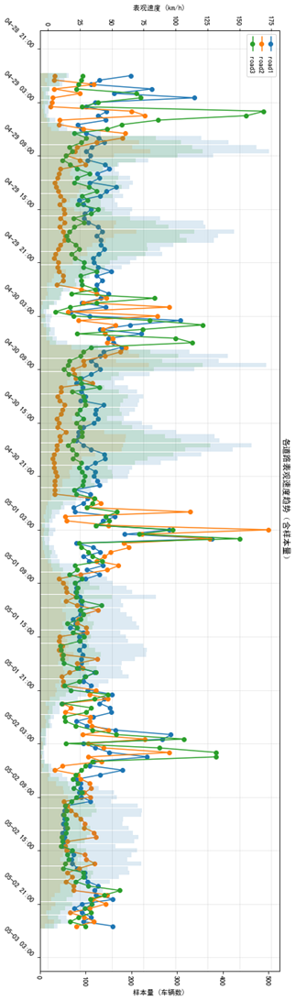