这部分来自数据库这门课的学习，下面内容主要来自实验报告。数据库软件是SQL server。

为了更好理解Django对于数据库的操作，先介绍其依托的pyodbc库。

## 前情提要：pyodbc

这一部分需要安装ODBC Driver 17 for SQL Server，这是微软官方提供的使用 ODBC 标准的数据库连接驱动程序，用于在应用程序和 SQL Server 之间建立通信桥梁。如果安装 SQL Server 相关工具和环境的时候已经安装该功能则可略过。

本实验采用Python3.12，第一种方案基于外部库pyodbc，第二种方案基于后端开发库Django的数据库处理模块django.db。

### pyodbc库介绍

Python的外部库 pyodbc 是一个开源的 Python 模块，它允许 Python 程序通过 ODBC 标准接口访问各种数据库管理系统。该库支持多种数据库系统，包括 Microsoft SQL Server、MySQL、PostgreSQL、Oracle、SQLite 等，这使其成为跨平台数据库交互的有力工具。

pyodbc 实现了 DB-API 2.0 规范，并提供了更符合 Python 风格的便捷功能，简化了数据库连接、SQL 语句执行、结果集处理、事务管理等操作。

```bash
pip install pyodbc
```

使用以上命令行语句安装，Python3.12默认安装5.3.0版本的pyodbc。

pyodbc编程有两个核心类/对象。

第一个是“数据库连接对象”，它是一次数据库访问从连接到释放的最高级抽象，使用pyodbc.connect()方法建立，其中需要填入格式化的字符串作为参数。

第二个是“游标对象”，它是“数据库连接对象”的cursor()方法返回的，是执行SQL命令和获取结果的抽象执行者。它的execute()方法填入SQL语句，fetch系列方法获得执行结果。

它们的使用都需要释放，一个基本框架如下：

```python
import pyodbc

conn = pyodbc.connect(
    'DRIVER={ODBC Driver 17 for SQL Server};'
    'SERVER=......;'
    'UID=......;'
    'PWD=......'
)

cursor = conn.cursor()

# 打印版本作为验证
cursor.execute("SELECT @@VERSION")
print(cursor.fetchone())

# 查询 CUSTOMER 表前 10 条
print("=== 前 10 个客户 ===")
cursor.execute("SELECT TOP(10) * FROM BUPT_DBLAB.dbo.CUSTOMER")
for row in cursor.fetchall():
    print(row)

cursor.close()
conn.close()
```

### 增删改查代码与运行结果

设计如下对单表进行增删改查的代码：

```python
import pyodbc

# 修改连接配置，设置默认数据库
conn = pyodbc.connect(
    'DRIVER={ODBC Driver 17 for SQL Server};'
    'SERVER=10.129.78.132;'
    'DATABASE=BUPT_DBLAB;'
    'UID=LeoTian;'
    'PWD=LeoTian'
)

cursor = conn.cursor()

print("=== 查前5条数据 ===")
cursor.execute("SELECT TOP(5) * FROM CUSTOMER")
original_records = []
for i, row in enumerate(cursor.fetchall(), 1):
    original_records.append(row)
    print(f"{i}|{row}")

# 1. 查询当前表中的记录数
print("\n=== 当前客户总数 ===")
cursor.execute("SELECT COUNT(*) FROM CUSTOMER")
original_count = cursor.fetchone()[0]
print(f"原始总数: {original_count}")

# 2. 查询最后一条记录的信息
print("\n=== 查询最后一条记录作为模板 ===")
cursor.execute("""
    SELECT C_CUSTKEY, C_NAME, C_ADDRESS, C_NATIONKEY, C_PHONE, C_ACCTBAL, C_MKTSEGMENT, C_COMMENT 
    FROM CUSTOMER 
    ORDER BY C_CUSTKEY DESC
""")
template_record = cursor.fetchone()

if not template_record:
    print("表中无数据")
    exit()

print("模板记录:", template_record)
template_custkey = template_record[0]

# 3. 基于最后一条记录创建新记录
print("\n=== 插入基于模板的新记录 ===")
try:
    # 基于最后一条记录，修改一下，创建新记录
    new_custkey = template_custkey + 1  # 新的主键
    new_name = template_record[1].replace("Customer#", "Test#")
    new_address = "MODIFIED"
    new_nationkey = template_record[3]
    new_phone = template_record[4]
    new_acctbal = template_record[5] + 100
    new_mktsegment = "MODIFIED"
    new_comment = "MODIFIED"

    insert_sql = """
    INSERT INTO CUSTOMER (C_CUSTKEY, C_NAME, C_ADDRESS, C_NATIONKEY, C_PHONE, C_ACCTBAL, C_MKTSEGMENT, C_COMMENT)
    VALUES (?, ?, ?, ?, ?, ?, ?, ?)
    """
    cursor.execute(insert_sql, (new_custkey, new_name, new_address, new_nationkey,
                                new_phone, new_acctbal, new_mktsegment, new_comment))
    conn.commit()
    print(f"成功插入新记录，C_CUSTKEY: {new_custkey}")

except Exception as e:
    print(f"插入记录失败: {e}")
    conn.rollback()
    exit()

# 验证插入结果
cursor.execute("SELECT COUNT(*) FROM CUSTOMER")
after_insert_count = cursor.fetchone()[0]
print(f"插入后总数: {after_insert_count}")

# 4. 查询并显示刚插入的记录
cursor.execute("SELECT * FROM CUSTOMER WHERE C_CUSTKEY = ?", (new_custkey,))
inserted_record = cursor.fetchone()
print("\n=== 刚插入的记录 ===")
print("插入的记录:", inserted_record)

# 5. 对刚插入的记录进行修改
print("\n=== 对插入的记录进行修改 ===")
try:
    second_update_sql = """
    UPDATE CUSTOMER 
    SET C_NAME = ?, C_ADDRESS = ?, C_ACCTBAL = ?, C_COMMENT = ?
    WHERE C_CUSTKEY = ?
    """
    # 进行第二次修改
    second_name = new_name.replace("Test#", "Final#")
    second_address = "FINAL"
    second_acctbal = new_acctbal + 50  # 修改余额
    second_comment = "FINAL"

    cursor.execute(second_update_sql, (second_name, second_address, second_acctbal, second_comment, new_custkey))
    conn.commit()
    print(f"成功对C_CUSTKEY为 {new_custkey} 的记录进行修改")

    # 显示第二次修改后的记录
    cursor.execute("SELECT * FROM CUSTOMER WHERE C_CUSTKEY = ?", (new_custkey,))
    second_modified_record = cursor.fetchone()
    print("第二次修改后的记录:", second_modified_record)

except Exception as e:
    print(f"第二次修改记录失败: {e}")
    conn.rollback()
    exit()

# 6. 删除新创建和修改后的记录
print("\n=== 删除新创建的记录 ===")
try:
    delete_sql = "DELETE FROM CUSTOMER WHERE C_CUSTKEY = ?"
    cursor.execute(delete_sql, (new_custkey,))
    conn.commit()
    print(f"成功删除C_CUSTKEY为 {new_custkey} 的记录")

except Exception as e:
    print(f"删除记录失败: {e}")
    conn.rollback()
    exit()

# 最终验证
print("\n=== 最终验证 ===")
cursor.execute("SELECT COUNT(*) FROM CUSTOMER")
final_count = cursor.fetchone()[0]
print(f"最终总数: {final_count}")
print(f"原始总数: {original_count}")

# 清理资源
cursor.close()
conn.close()
print("\n数据库连接已关闭")

```

代码查询到最后一条记录，稍作修改插入到表中，然后对该记录进行修改，最后删除，每一步操作都查询操作结果如何。

多表查询没有额外的设计，直接使用如下嵌入式的代码即可：

```python
# 关联查询：每个客户的订单总金额
print("\n=== 客户订单总金额 ===")
sql = """
SELECT top(10) c.C_CUSTKEY, c.C_NAME, SUM(o.O_TOTALPRICE) AS total_spent 
FROM BUPT_DBLAB.dbo.CUSTOMER c 
JOIN BUPT_DBLAB.dbo.ORDERS o ON c.C_CUSTKEY = o.O_CUSTKEY 
GROUP BY c.C_CUSTKEY, c.C_NAME
ORDER BY c.C_CUSTKEY, c.C_NAME
"""
cursor.execute(sql)
for row in cursor.fetchall():
    print(row)
```


## 基于django.db的接口式访问

### Django库的数据库模块介绍

在Python中有多种外部库可以用来接口式地操作SQL Server数据库，最主流的方案是使用SQLAlchemy库。

本实验使用另一个外部库，即Python的最主流后端开发工具库Django，它的模块django.db是Django框架中用于处理数据库的核心组件，它通过将Python类映射到数据库表，使开发者能够以面向对象的方式操作数据，而无需直接编写SQL语句。

使用Django进行后端开发经常使用django.db提供的ORM方案（Object Relational Mapping，对象关系映射）对各类数据库进行操作，其Python代码是一致的，随着数据库不同其映射出的操作方法也不同。

不开启完整的后端服务，该模块对于数据库的操作依然是可用的。

本实验采用Python3.12，Django版本号是5.1.7。另外，还需安装

```bash
pip install mssql-django
```

mssql-django是一个为 Django框架提供的数据库后端，专门用于连接和操作 Microsoft SQL Server 和 Azure SQL 数据库。它作为 django-mssql-backend 项目的分支，旨在提供更稳定、高效的 SQL Server 支持，并持续更新以兼容较新的 Django 版本。的。Django 3.0 及以上版本中，官方不再推荐使用旧的 django.db.backends.mssql 引擎，而是转向如 sql_server.pyodbc 等现代后端，mssql-django 正是这类解决方案的代表。

mssql-django是基于上一小节使用的 pyodbc ，正因如此，一个最简单的使用Django连接SQL Server的代码如下所示，它用conn和cursor（详见上小节）进行验证：

```python
import django

from django.conf import settings

settings.configure(
    DATABASES={
        'default': {
            'ENGINE': 'mssql',
            'NAME': 'BUPT_DBLAB',
            'HOST': '......',
            'PORT': '',
            'USER': '......',
            'PASSWORD': '......',
            'OPTIONS': {
                'driver': 'ODBC Driver 17 for SQL Server',
            },
        }
    },
)

django.setup()

from django.db import connections

try:
    conn = connections['default']
    cursor = conn.cursor()
    cursor.execute("SELECT TOP(5) * FROM BUPT_DBLAB.dbo.CUSTOMER")
    rows = cursor.fetchall()
    print("连接成功! 获取到", len(rows), "条记录")
    for row in rows:
        print(row)
except Exception as e:
    print("错误:", e)

```


运行结果：

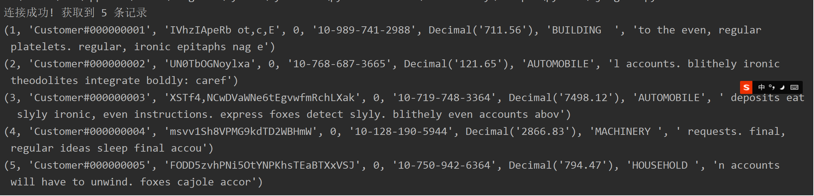

这样就验证了是否连接上数据库系统。

回到具体使用上，Django使用其自己的models.Model类对数据库的表容器、操作等等进行抽象，models位于django.db（即使用from django.db import models导入）。使用之前，需要继承modelss.Model类，类似地用如下代码创建好数据模型。

这些代码应该单独成为一个.py文件，而且应该放入一个文件夹（本实验名为demo），并且放入任意一个名为__init__.py的文件在该文件夹中，以标识这个一个Python包。届时，Django的配置项中应该导入这个Python包以作为其所谓的app包，这是Django进行模块管理的要求。

```python
# 定义模型（映射现有表）
from django.db import models


class Customer(models.Model):
    C_CUSTKEY = models.IntegerField(primary_key=True)
    C_NAME = models.CharField(max_length=25)
    C_ADDRESS = models.CharField(max_length=40)
    C_NATIONKEY = models.IntegerField()
    C_PHONE = models.CharField(max_length=15)
    C_ACCTBAL = models.DecimalField(max_digits=15, decimal_places=2)
    C_MKTSEGMENT = models.CharField(max_length=10)
    C_COMMENT = models.CharField(max_length=117)

    class Meta:
        app_label = 'demo'
        db_table = 'CUSTOMER'  # 移除dbo前缀，Django会自动处理schema
        managed = False

    def __str__(self):
        return self.C_NAME


class Orders(models.Model):
    O_ORDERKEY = models.IntegerField(primary_key=True)
    O_CUSTKEY = models.IntegerField()
    O_ORDERSTATUS = models.CharField(max_length=1)
    O_TOTALPRICE = models.DecimalField(max_digits=15, decimal_places=2)
    O_ORDERDATE = models.DateField()
    O_ORDERPRIORITY = models.CharField(max_length=15)
    O_CLERK = models.CharField(max_length=15)
    O_SHIPPRIORITY = models.IntegerField()
    O_COMMENT = models.CharField(max_length=79)

    # 建立与Customer的外键关系
    CUSTOMER = models.ForeignKey(
        Customer,
        on_delete=models.DO_NOTHING,
        db_column='O_CUSTKEY',  # 映射数据库中的真实字段名
        to_field='C_CUSTKEY',  # 外键目标字段
        related_name='orders'
    )

    class Meta:
        app_label = 'demo'
        db_table = 'ORDERS'  # 移除dbo前缀
        managed = False

    def __str__(self):
        return f"Order {self.O_ORDERKEY} - {self.O_ORDERPRIORITY}"

```

其中，“related_name='orders'”是一个关联名称，它帮助后续查询的时候，直接从Customer实例访问到Orders上的属性。观察这两个Model子类的定义，这实际上完全对应了如下建表语句：

```sql
CREATE TABLE CUSTOMER (
    C_CUSTKEY INTEGER NOT NULL,
    C_NAME VARCHAR(25) NOT NULL,
    C_ADDRESS VARCHAR(40) NOT NULL,
    C_NATIONKEY INTEGER NOT NULL,
    C_PHONE CHAR(15) NOT NULL,
    C_ACCTBAL DECIMAL(15,2) NOT NULL,
    C_MKTSEGMENT CHAR(10) NOT NULL,
    C_COMMENT VARCHAR(117) NOT NULL);

CREATE TABLE ORDERS (
    O_ORDERKEY INTEGER NOT NULL,
    O_CUSTKEY INTEGER NOT NULL,
    O_ORDERSTATUS CHAR(1) NOT NULL,
    O_TOTALPRICE DECIMAL(15,2) NOT NULL,
    O_ORDERDATE DATE NOT NULL,
    O_ORDERPRIORITY CHAR(15) NOT NULL,
    O_CLERK CHAR(15) NOT NULL,
    O_SHIPPRIORITY INTEGER NOT NULL,
    O_COMMENT VARCHAR(79) NOT NULL);

ALTER TABLE CUSTOMER
ADD PRIMARY KEY (C_CUSTKEY);
ALTER TABLE CUSTOMER
ADD FOREIGN KEY (C_NATIONKEY) references NATION;
ALTER TABLE ORDERS
ADD PRIMARY KEY (O_ORDERKEY);
```

事实上，实际场景下完全基于Django后端的项目中，数据库的建表操作也是使用Django ORM完成的，此处并没有用到这个功能。

以后，配置项应该加入：

```python
settings.configure(
    DATABASES={
       ......
    },
    INSTALLED_APPS=[
        'demo',  # 数据模型所在的 app
    ]
)
```

Model.objects是对数据库交互的抽象，是Django交互数据库的主要接口，这个对象类有大量方法。一个最简单的使用ORM代码进行查询的方法如下：

```python
import django
from django.conf import settings

settings.configure(......)

django.setup()

from demo.djangomodels import Customer, Orders
from django.db import models


def demo_interface_style():
    print("前10个客户:")
    customers = Customer.objects.all()[:10]
    for c in list(customers):
        print(f"ID: {c.C_CUSTKEY}, Name: {c.C_NAME}")

if __name__ == "__main__":
    demo_interface_style()
```

运行结果：

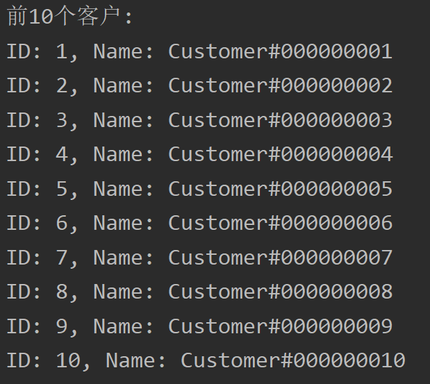


### 增删改查代码与运行结果

本部分对Model.objects对象类的核心方法的使用做演示和介绍，这些方法涵盖各种增删改查及其变体。

all()方法：获取所有数据记录，每一个记录是定义的Model继承类的一个实例，前文已经演示。
其实，有了all()方法，之后的所有操作都可以放在Python完成，为了利用数据库系统的优化，以下方法依然是必要的。

get()方法：获取一条记录，相当于where等值查询，而且只会返回一条记录：

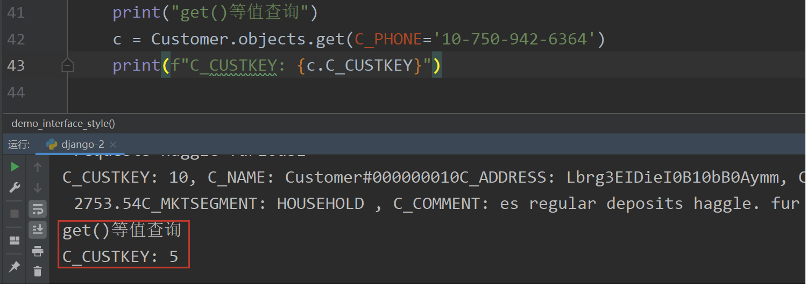

filter()方法：条件过滤，相当于where范围查询。这个方法表示大于小于条件需要用一种特别的语法，其也可以使用等值查询，会返回所有结果，区别于all()只返回一个。

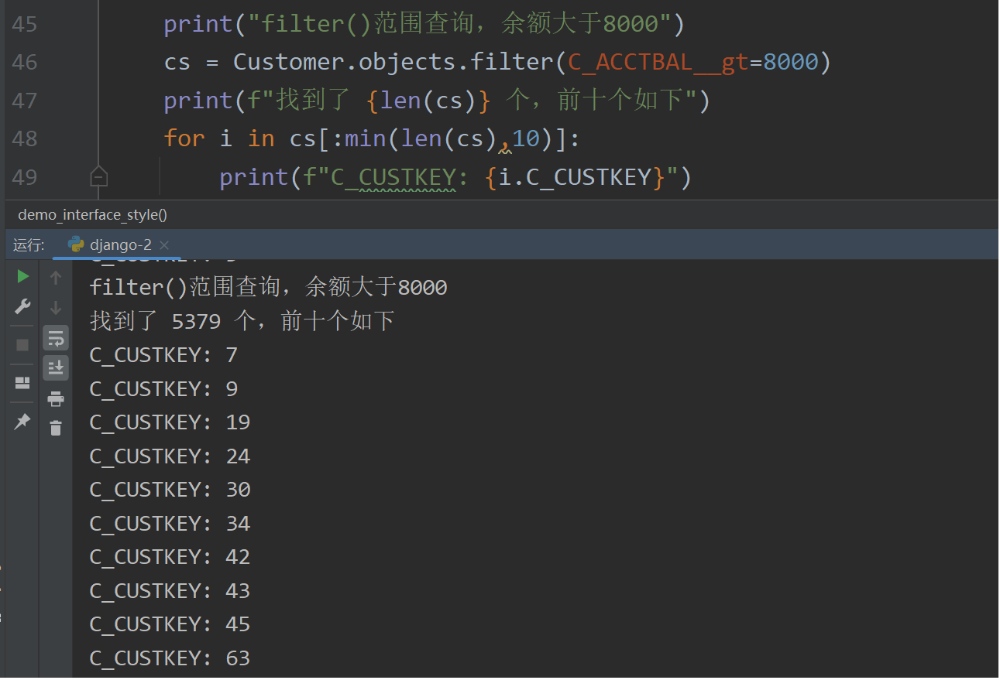

exclude()方法：反条件过滤，相当于filter()方法条件取反：

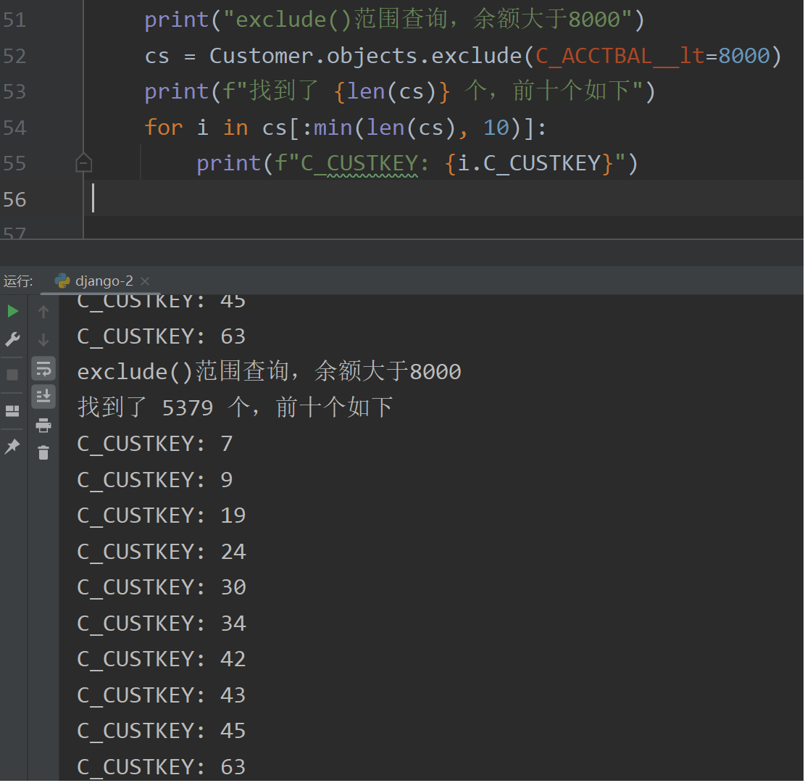

Q对象：这是一个重载了Python布尔运算符的对象，可以用来实现组合条件的查询，相当于where后使用布尔表达式连接一些组合条件：

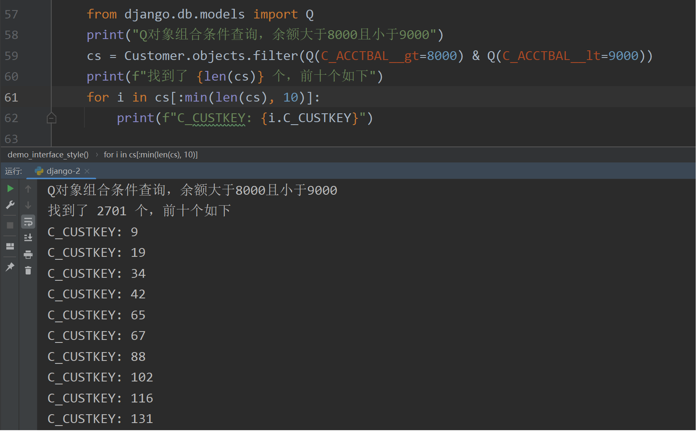

实际上，对于与条件，语句

```python
cs = Customer.objects.filter(Q(C_ACCTBAL__gt=8000) & Q(C_ACCTBAL__lt=9000))
```

等价于

```python
cs = Customer.objects.filter(C_ACCTBAL__gt=8000).filter(C_ACCTBAL__lt=9000)
```

但是，对于或条件，采用Q对象会更加方便。

字符匹配相关方法：例如含有子串关系，另外其还支持开头、结尾、正则表达式等等：

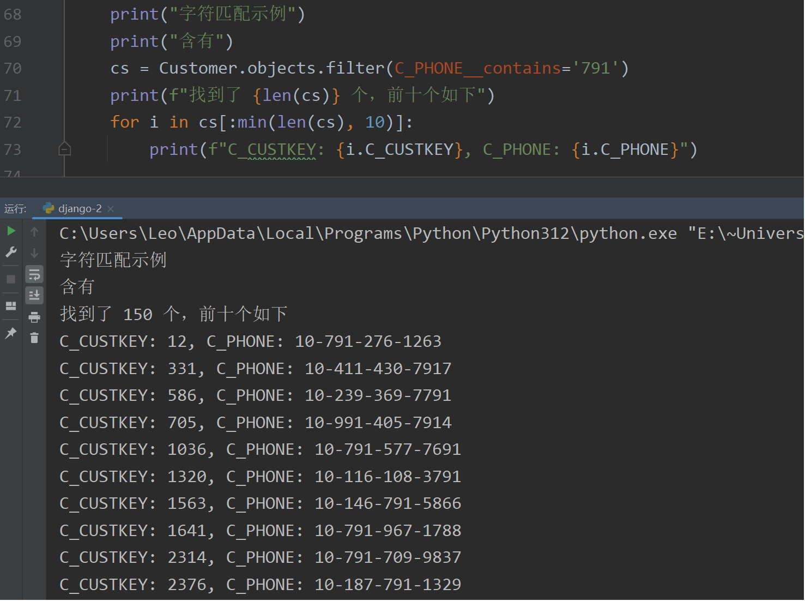

还有其他若干查询写法，大多都使用“双下划线后缀”的语法。

distinct()：返回去重结果。

values()：可以看做实现了投影功能，填入一个（或者多个）字符串表示的属性名，把表在这些属性上投影，后文实现分组聚集的时候该方法会起到作用。这个方法默认不去重，可以结合distinct()实现去重。

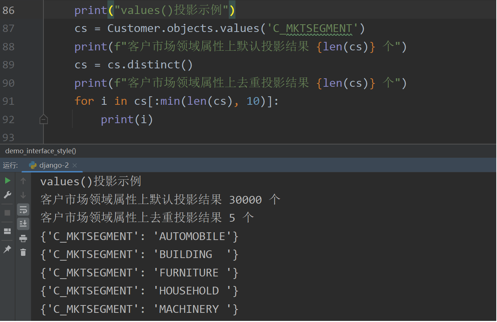

F表达式：这用于在各个参数中需要引用某个属性列的时候进行包装。

Value表达式：有一些方法的参数需要把基本数据进行包装。以上两个示例结合下面方法演示。

annotate()单独使用方法1：创建一个临时列，这不修改数据库，但是之后的方法调用可以使用这个列：

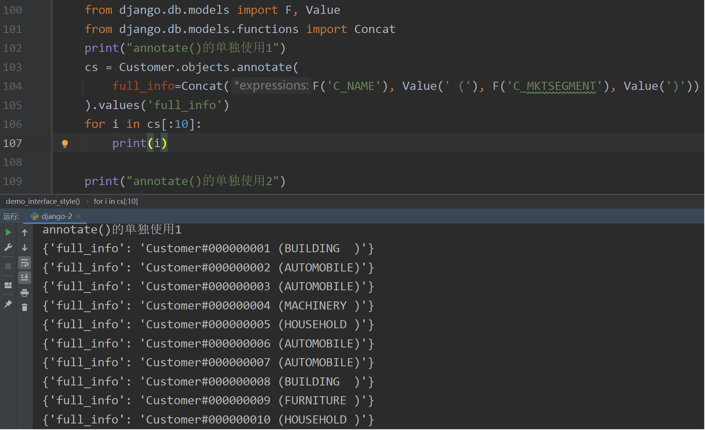

order_by()：排序，该方法之后传入多个属性，就是多属性排序：

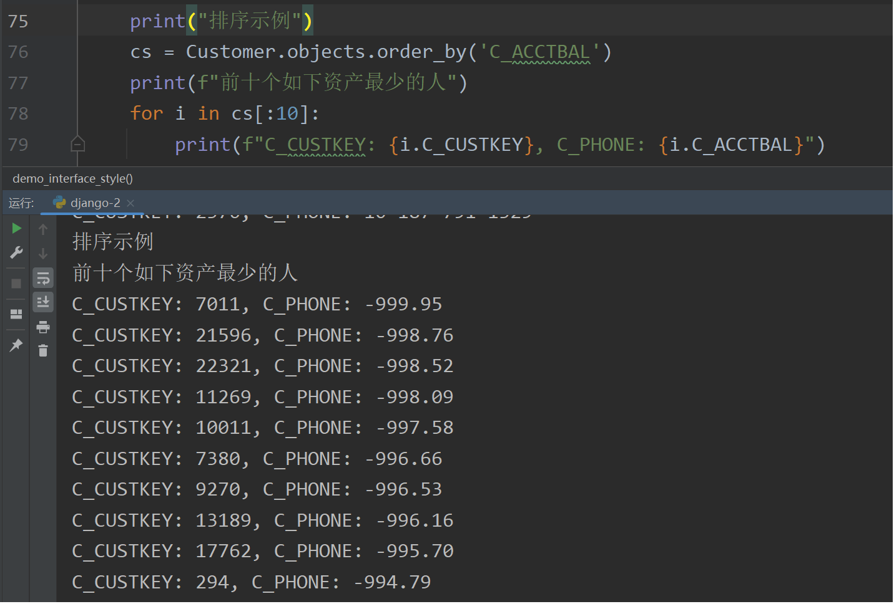

聚集还有分组聚集用两个不同方法实现。

aggregate()：填入一个聚集函数，聚合函数的参数是一个用字符串表示的属性名，把调用者在这个属性上按照聚集函数聚集出一个结果：

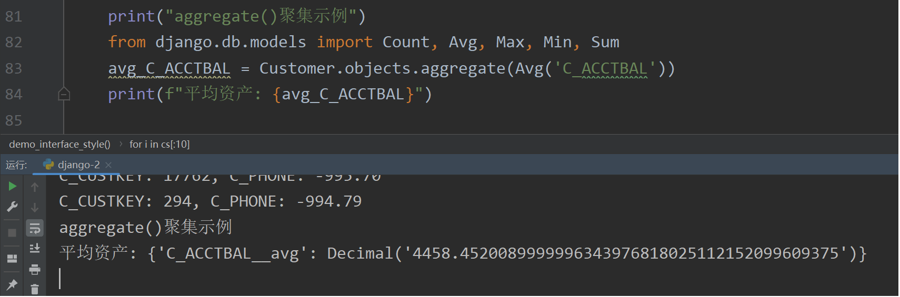

annotate()分组聚集用法：可以单独使用，也可以结合values()实现分组聚集：

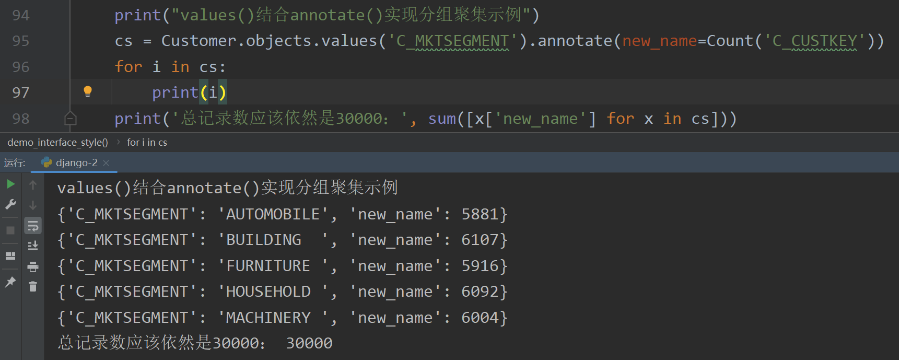

这相当于

```sql
SELECT C_MKTSEGMENT, COUNT(C_CUSTKEY) AS new_name
FROM customer
GROUP BY C_MKTSEGMENT
```

annotate()单独使用方法2：另一种单独使用的方法，可以在被参考表上建立的反向外键关系上做聚集，例如此处Orders表有外键参考到Customer上，Customer表可以用这个信息聚合出被几个参考表的记录参考，实际场景中这里的意义是识别顾客活跃与否，只需要再加上筛选或者排序：

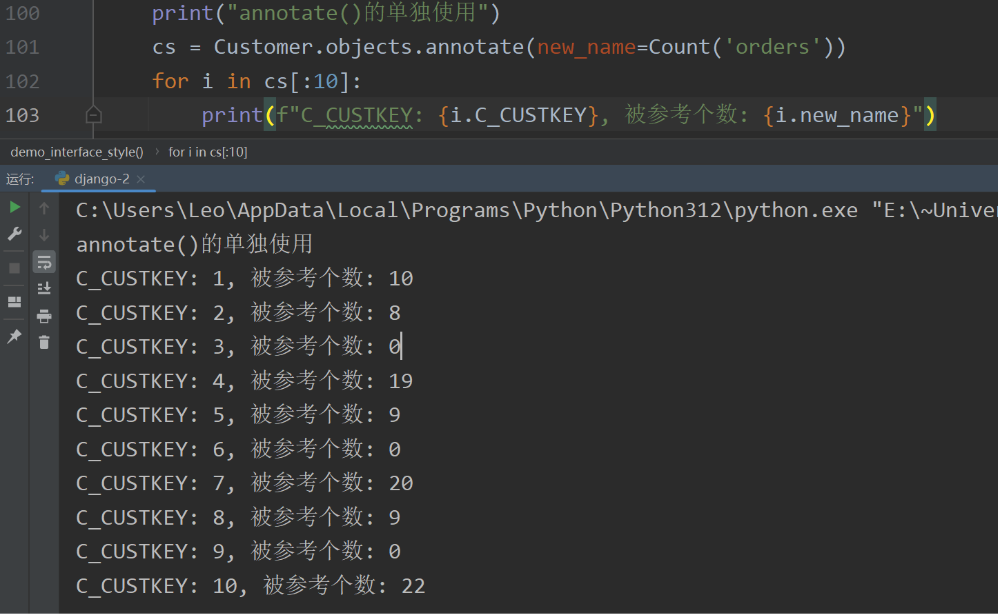

总之，这一语句

```sql
SELECT a,b, SUM(c) as sum_c
FROM table0
WHERE (filter_condition1)
GROUP BY d
HAVING (filter_condition2)
ORDER BY a
```

在Django中可以写为

```python
Table0.objects.filter(filter_condition1) \  # WHERE
    .values('d') \  # GROUP BY
    .annotate(sum_c=Sum('c')) \  # GROUP BY
    .values('a', 'b', 'agg_c') \  # SELECT
    .filter(filter_condition2) \  # HAVING
    .order_by('a') # ORDER BY
```

多表查询只介绍利用外键的多表查询，因为Django对于任意两个表的多表查询支持并不良好，这通常涉及到不良好的数据模型定义、raw()方法执行原始SQL等问题。如果按照前文方法定义外键，其使用方法十分简洁。

Orders 有到 Customer 的外键。从 Orders对象 访问 Customer对象 可以直接用“点+外键”方法：

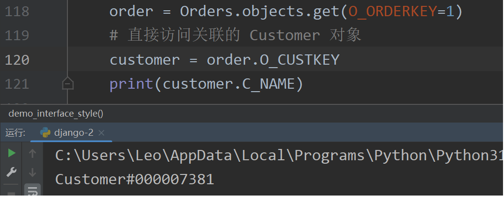

也可以一次性获取所有的外键关联数据对象，使用select_related()方法：

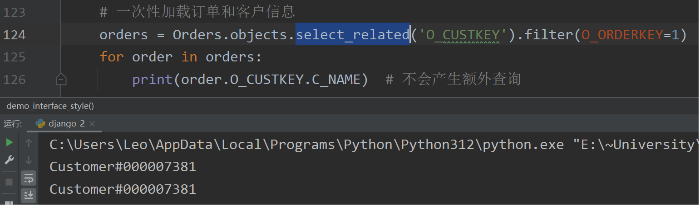

还可以使用“双下划线”语法直接访问被参照表的属性：

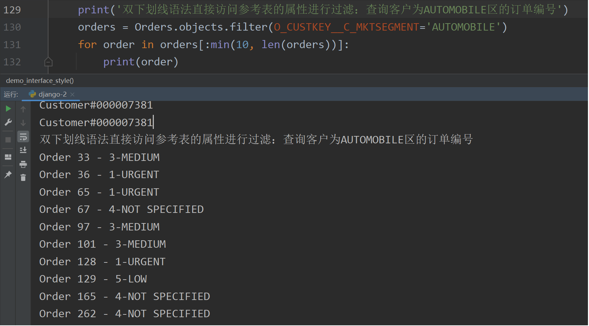

也支持反向访问，相比于“点+外键”，这里利用数据模型定义的“点+related_name”：

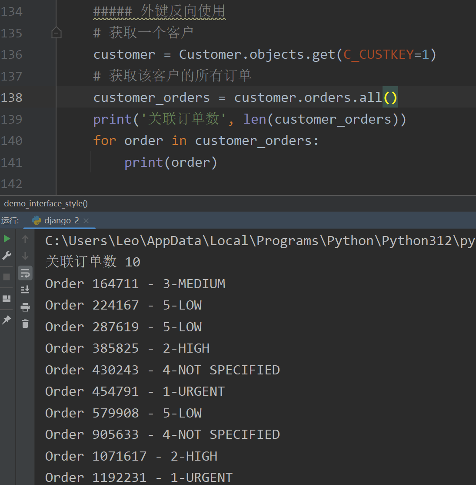

也可以使用“双下划线”语法直接访问参照表的属性：

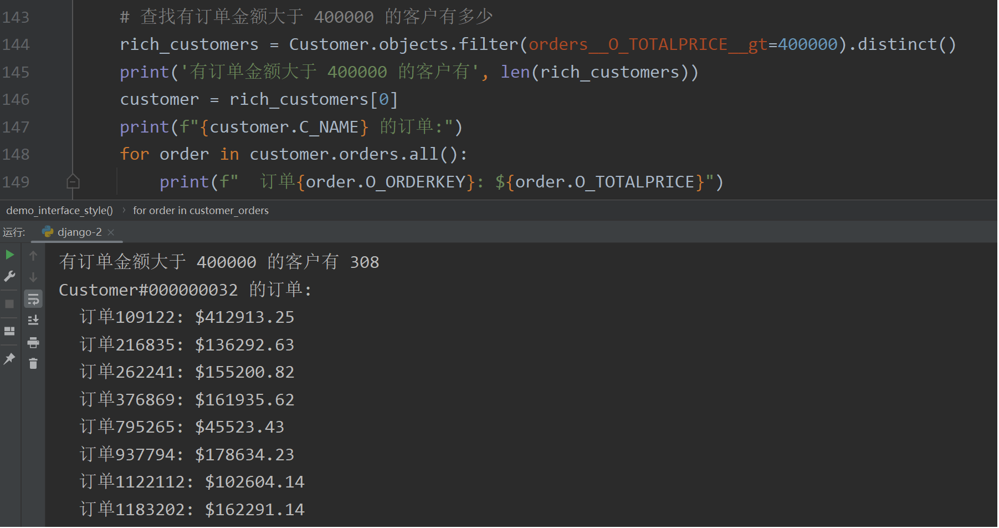


增删改代码，建议进行显式事务管理，from django.db import transaction，之后的事务代码应该放在with transaction.atomic():代码块之下。

```python
# 增
with transaction.atomic():
    new_customer = Customer(
        C_CUSTKEY=new_custkey,
        C_NAME=new_name,
        C_ADDRESS=new_address,
        C_NATIONKEY=new_nationkey,
        C_PHONE=new_phone,
        C_ACCTBAL=new_acctbal,
        C_MKTSEGMENT=new_mktsegment,
        C_COMMENT=new_comment
    )
    new_customer.save()

#改
with transaction.atomic():
    customer_to_update = Customer.objects.get(C_CUSTKEY=new_custkey)
    customer_to_update.C_NAME = second_name
    customer_to_update.C_ADDRESS = second_address
    customer_to_update.C_ACCTBAL = second_acctbal
    customer_to_update.C_COMMENT = second_comment
    customer_to_update.save()

#删
with transaction.atomic():
    customer_to_delete = Customer.objects.get(C_CUSTKEY=new_custkey)
    customer_to_delete.delete()
```

填入数据之后（代码省略），运行结果如下：

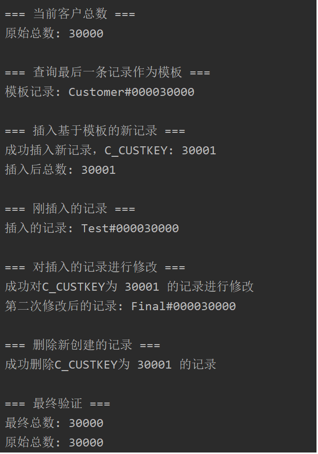

和预期相符合。
