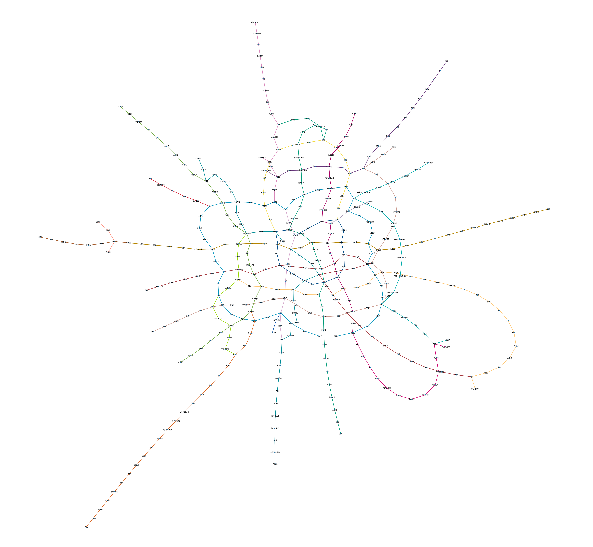
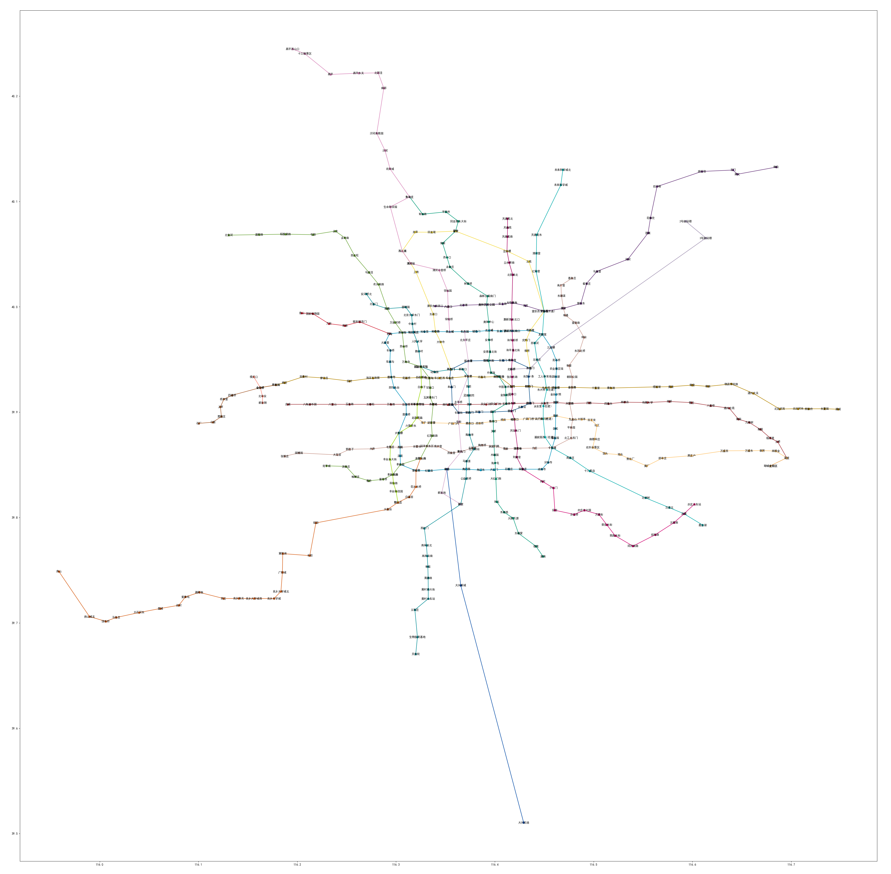
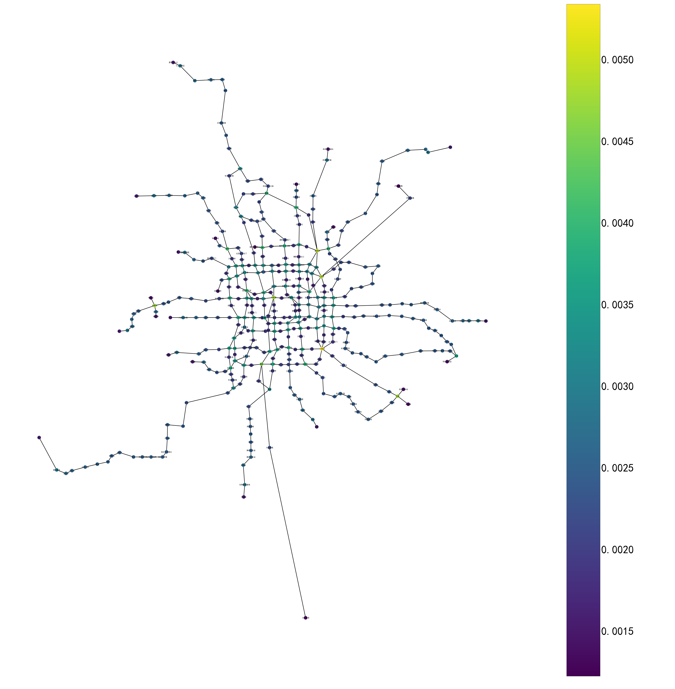
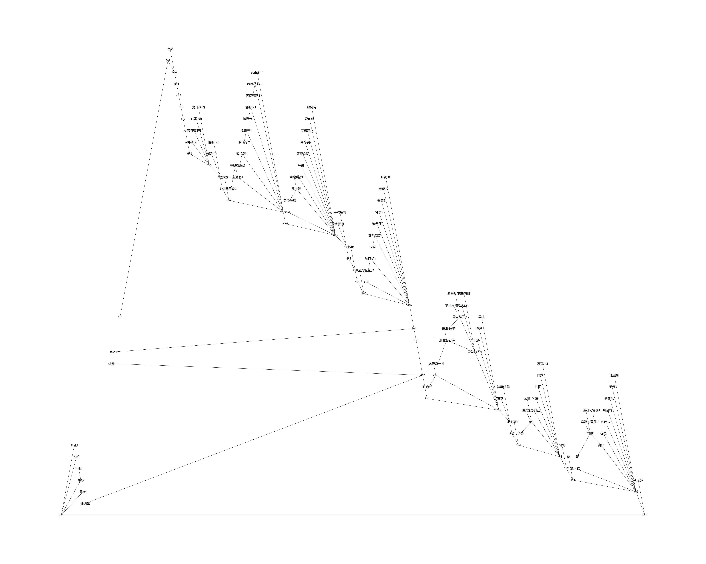
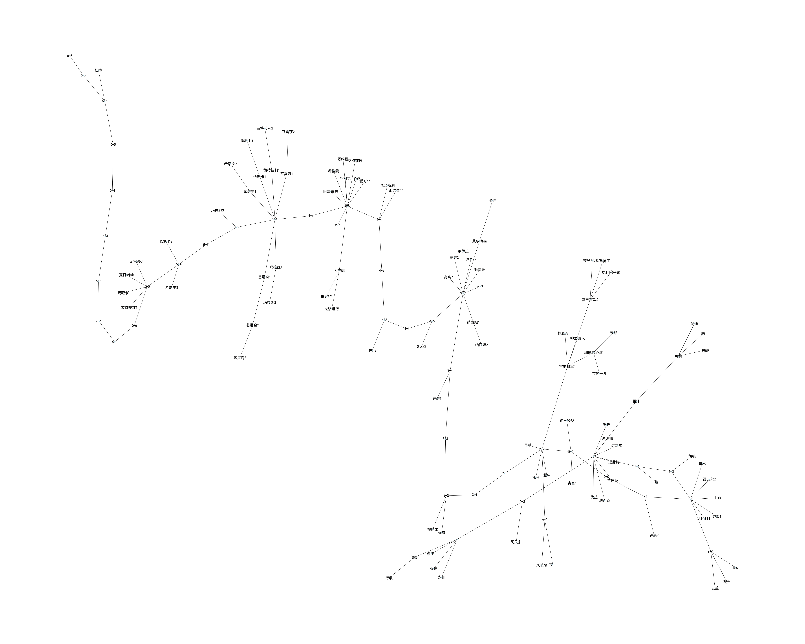

# networkx

处理图论问题的，说白了就是图数据结构。有人批评这个包效率特别低，不过方便还是方便。

## 北京地铁

比如说可以导入一个北京地铁的图，用某种图绘制算法（kamada_kawai_layout）画出来：

当然也可以按照经纬度画出来，不过就没有图论色彩了：

## 基础图数据挖掘

比如经典的Pagerank算法：

有的经典的图机器学习也可以用networkx，比如node2vec，把数据先导入，然后采样的过程就可以用networkx来做。不过我跑出来的效果不太好就算了（）

## 可视化

游戏的任务依赖图一般是无环图，例如游戏《原神》的主线任务图可视化如下，是一个经典的平面图绘制算法：

上面这个布局数据结构可以继续经过力学算法做调整，设置适中的迭代步数可以得到更加美观的结果：

