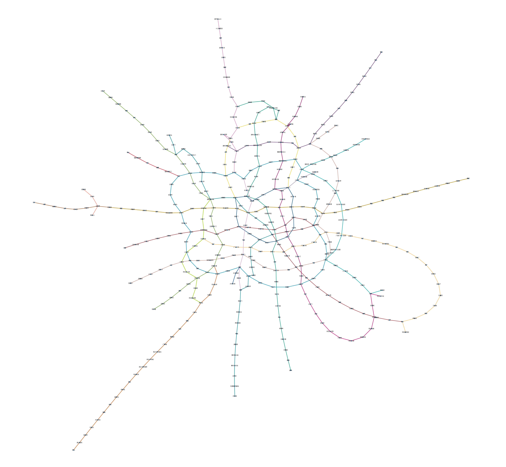
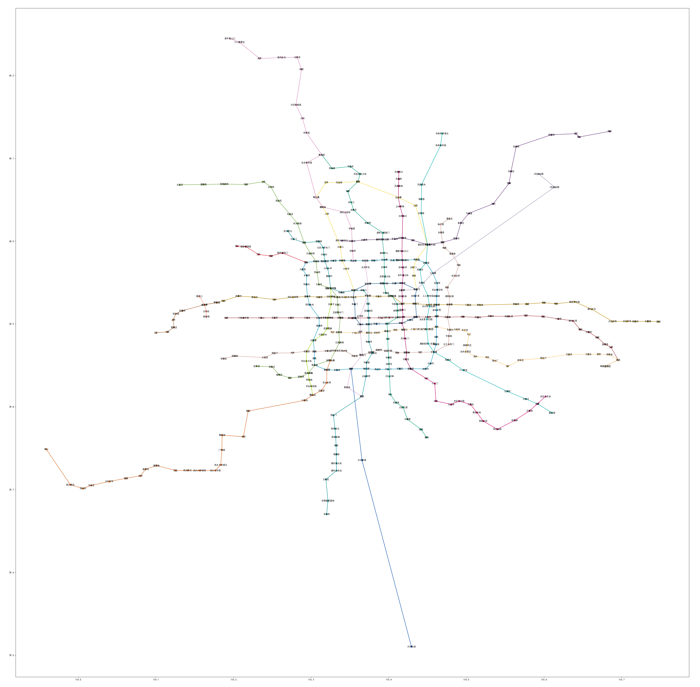
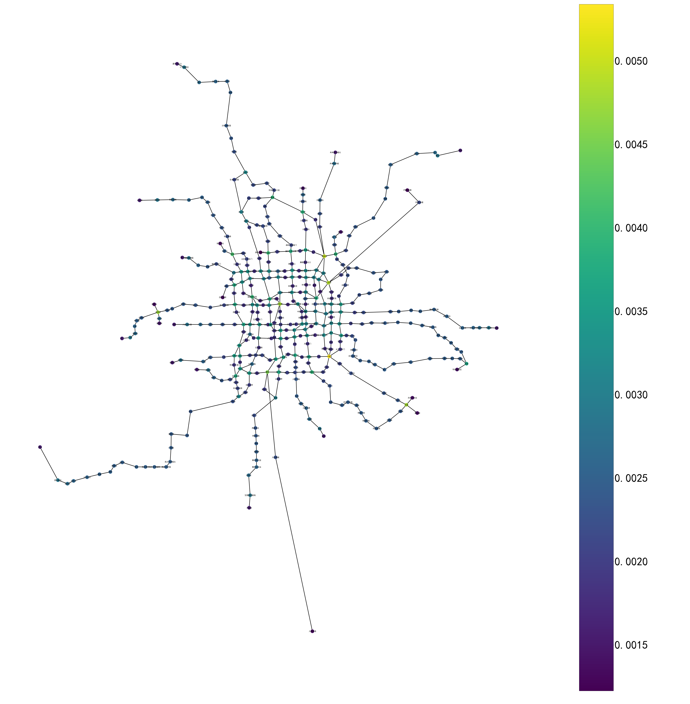

# networkx

这个东西不算一个“小”工具了，很多地方都可以用到，处理图论问题的。

## 北京地铁

比如说可以导入一个北京地铁的图，用某种图绘制算法（kamada_kawai_layout）画出来：

当然也可以按照经纬度画出来，不过就没有图论色彩了：

## 基础图数据挖掘

比如经典的Pagerank算法：

有的经典的图机器学习也可以用networkx，比如node2vec，把数据先导入，然后采样的过程就可以用networkx来做。不过我跑出来的效果不太好就算了（）