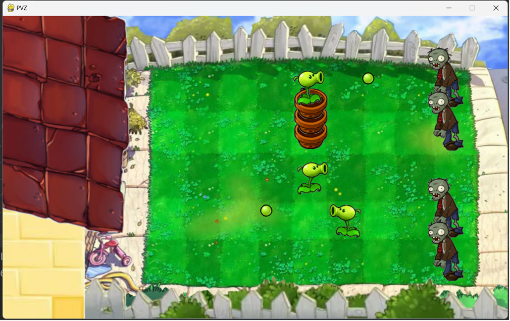
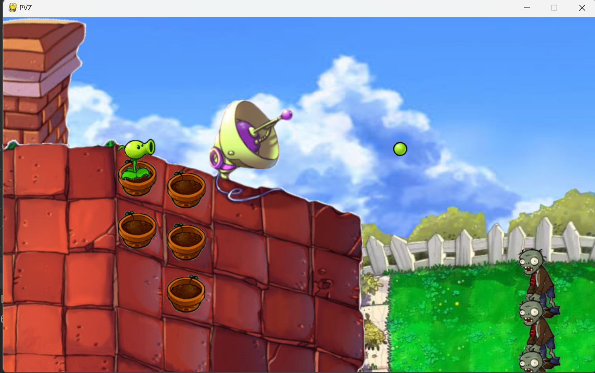
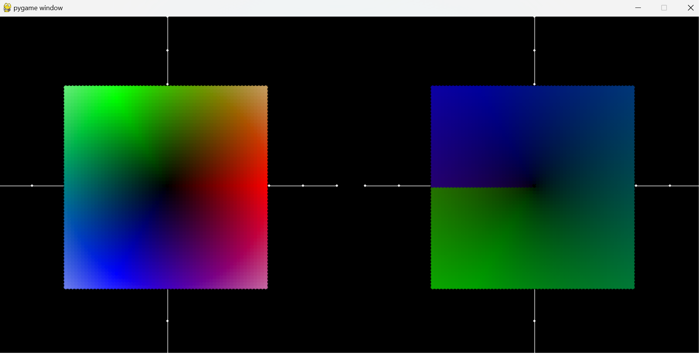

# pygame

显然，不很好用。。。但是也可以有一些成果：

## 植物大战僵尸的一个设想

这是一个植物大战僵尸最基础的样子，不过特点是三个地图被连接到一起了。

ASDW切换摄像头的位置，数字是植物或者功能，鼠标的左右键是朝左还是朝右放置植物。

还有一个特点就是花盆可以叠放，模拟高度。

- 高度太高就打不到僵尸了
- 僵尸会从倒数第二个花盆开始吃
- 屋顶的子弹还是照常，会被高度差阻挡

设想很是美好，不过这个实现还是太基础粗糙了，往下也很难进行下去了，大概也是受到pygame的限制。

## 五子棋

无需多言。

## 可 视 化 1

这是一个很变态的用法，显然当时作为初学者，显然是先于数据处理专门的可视化方法，先接触的pygame。

当时化学在讲共价键的构型还是什么的，当时只介绍了1,2,3,4对共价键的构型，那么接下来呢？

思路很简单，就是让几个小球相互在一个球面上排斥，收敛了就是结果了。显然pygame是个二维的画面，所以只好投影：

*两个共价键，就是个平角*

*其实这是个等边三角形，还在动等待收敛的时候可以看出来，截图不明显了*

*啊，熟悉的正四面体的四个顶点。甚至还实现了投影远近大小*

下面就是很少有人提到的东西，大概也是因为原子实际上很难塞进去10个电子，能量太高，很难形成太多共价键。

*左下和右上相对，北极和南极；剩下的三个平分赤道*

*上下两个纬度圈各自分布了三个电子对儿，两个等边三角形是岔着的，就是北极点看下去是个六芒星*

*最左和右下相对，北极和南极；剩下的五个平分赤道*

*正六面体的顶点，我唯一猜对了的*

## 可 视 化 2

当时我甚至用pygame可视化复变函数！想想真是逆天（）

我就选了一个代表性的，这左边的图用颜色给复平面原点附近的点编了码，然后经过一个复变函数，在右边画出原来这个点去了哪里。

怎么知道$z$和$f(z)$谁对谁？$z$和$f(z)$颜色是一样的。

上面的图其实是一个函数，都是$f(z)=z^2$。只不过，显然这个函数不是一对一的，很多点会映射到同一个地方。具体地，由于代数基本定理，每个像来自两个原像，所以可以画出两个图片。

第一张图是辐角在$[0,\frac{\pi}{2}] \cup [\frac{3\pi}{2},2\pi]$的情况，
第二张图是辐角在$[\frac{\pi}{2},\frac{3\pi}{2}]$的情况。