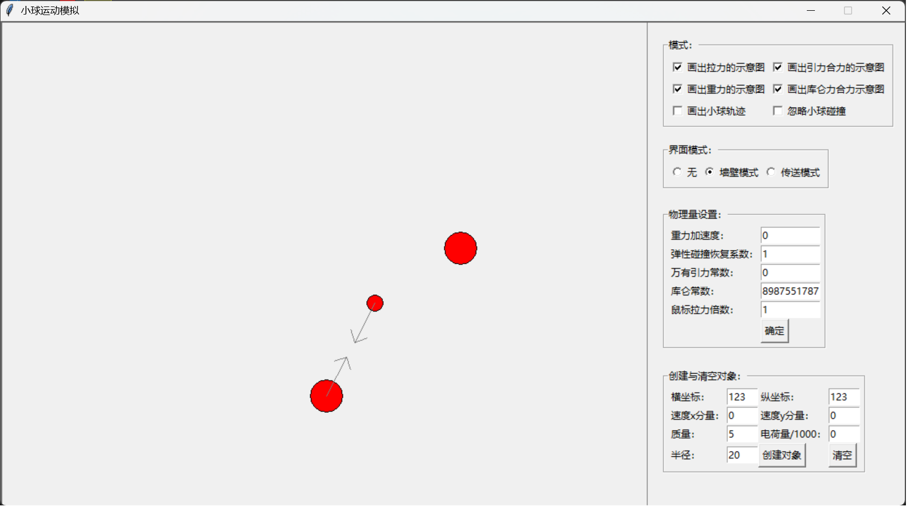
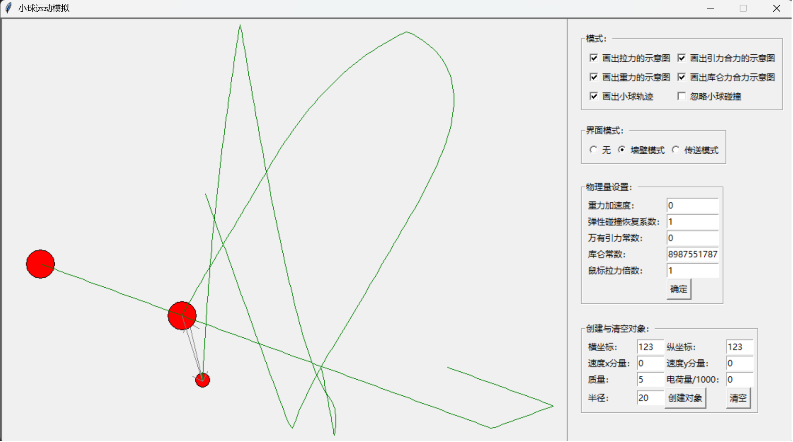
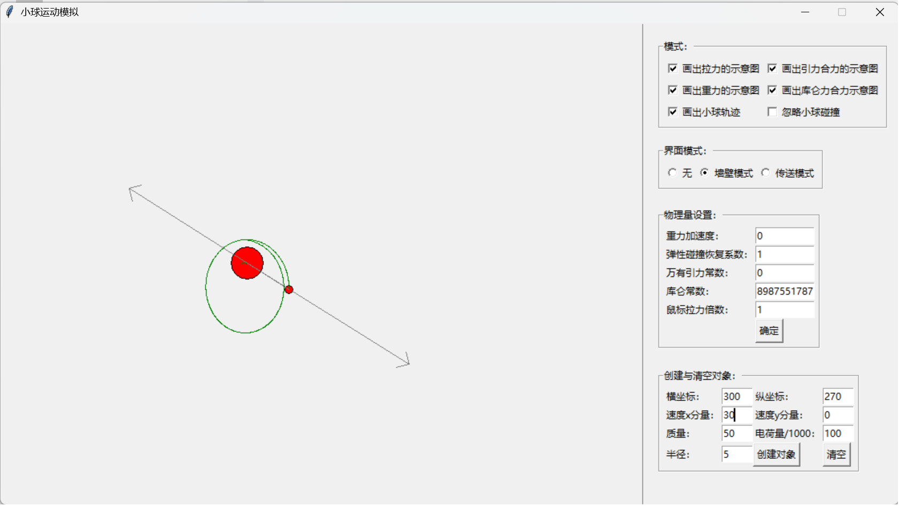
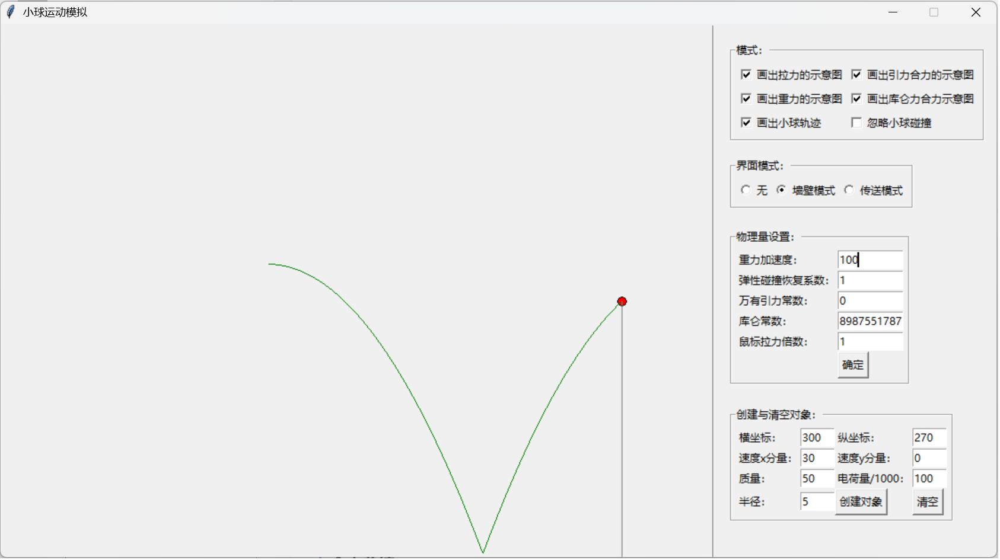
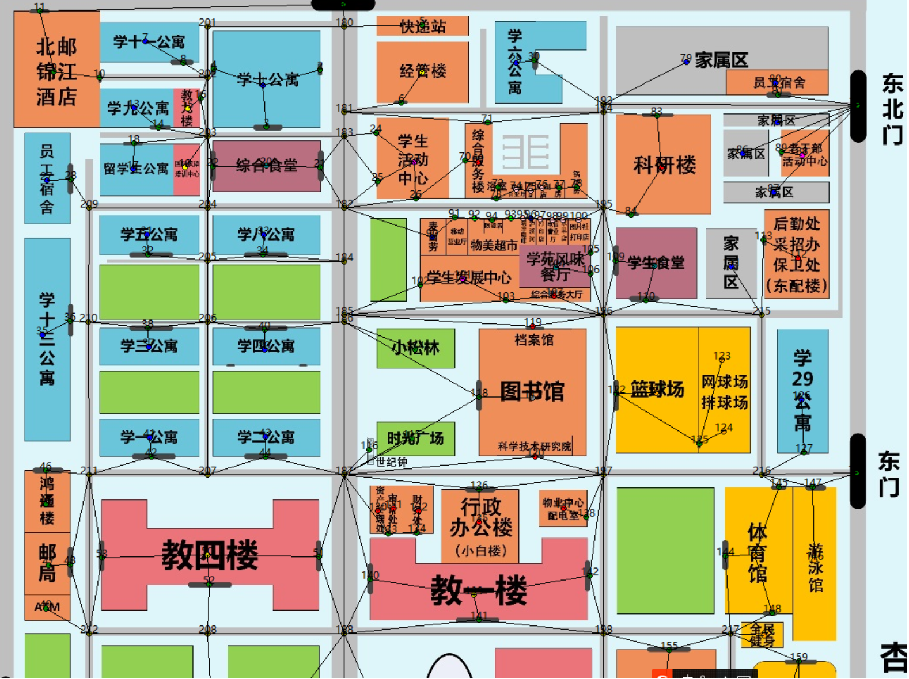
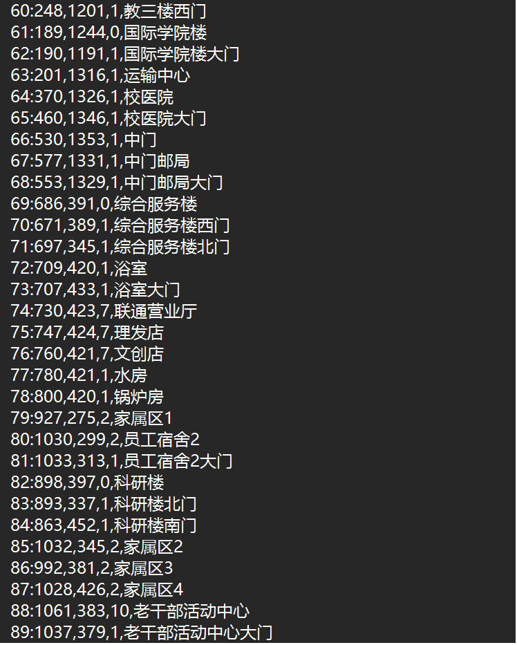

# tkinter

这是一个python自带的GUI库，开发不了大的东西。

## 物理模拟

这是一个小球的物理模拟程序：

*恒星质量比较小的椭圆运动，一圈之后就偏了*

*重力*

## 地图建模辅助打点连线

学校有个作业其中要用到地图数据，是非常细致的要求以至于现有地图api服务都满足不了，其他小组有人甚至人肉搞这个事情，一个地图四个小时（）

这个事情可以很容易地用tkinter简化工作流程。按键控制是打点还是连线，打点时候可以控制节点类型（超市、教学楼等等），弹窗输入节点名称；连线时候就是选择最近的点......总之非常容易，且效果良好，每次都会读取和输出文件。

