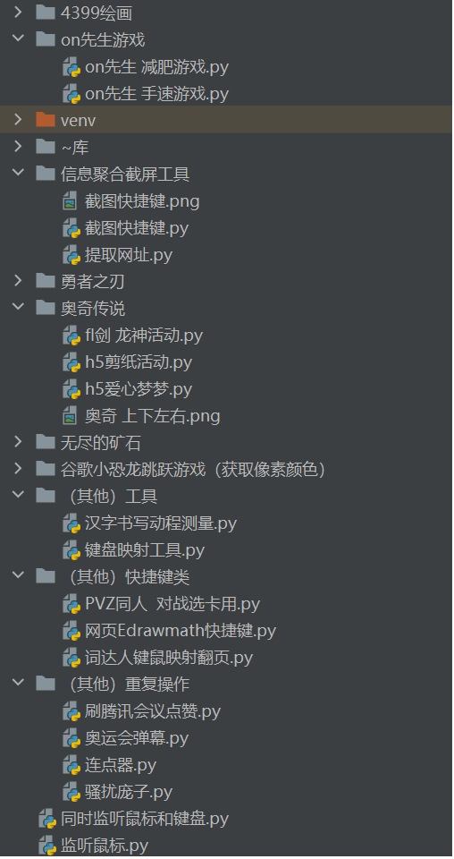

# 游戏脚本

很久没用过了，且当时是出于各种原因在一个长的时间范围上断续用过，
也很难图片演示与记录，以下简单记录。

## 项目里的文件

## 用到的轮子
- pynput结合pyautogui

    这是后来特别爱用的一个轻量化的组合。

    - pyautogui

        非常轻量化，甚至是面向过程的编程。

    - pynput

        功能很多，其中之一可以阻塞地启动一个监听键盘的循环，我主要使用的就是这个功能。

        监听到对应按键，就可以用pyautogui进行鼠标的操作，这个组合实现了键盘操作鼠标的自动化。
    
- PyUserInput

    这个安装好后，导入的时候，就像是按照独立地下载了pykeyboard、pymouse两个库一样。

    这两个用起来比较厚重，我记得当时有个拖动pymouse实现不了，就放弃这个方法了。

- ctypes

    可以获取屏幕上像素点的颜色。简单包装一下就是很好用的函数。

