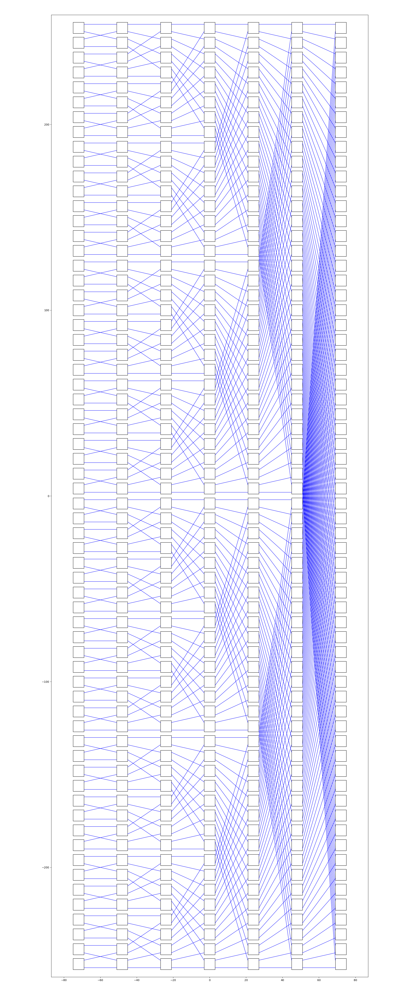
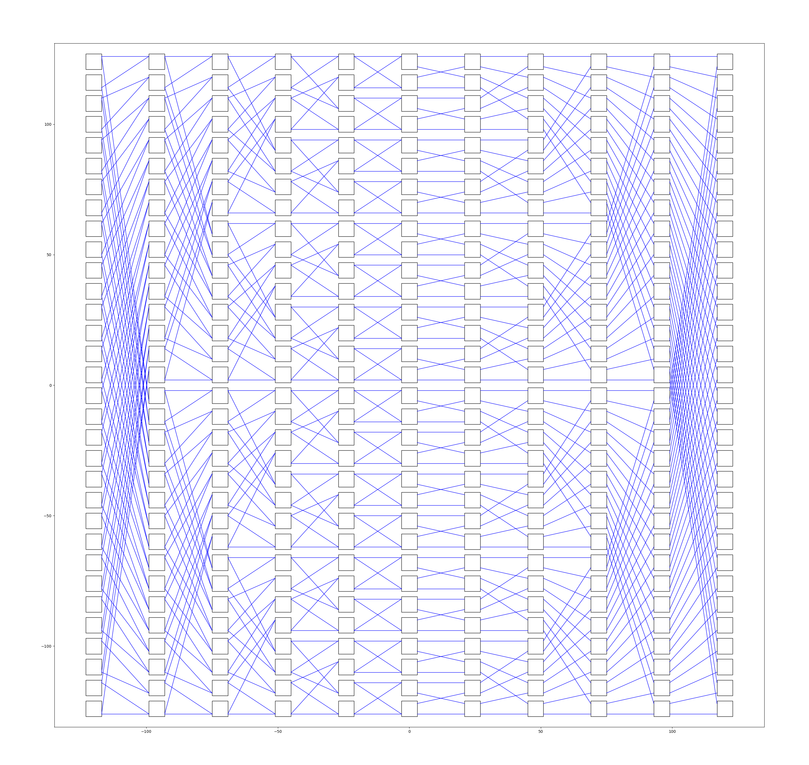

# Banyan和Benes网络

交换网络比较理论化的研究有一些模型，手绘十分折磨，所以写了个程序绘制。一开始想做成一个专门的包的，后来仔细思考了一下有更好的工具已经做了这事情，于是算了。

这是一个128*128的Banyan网络：



这是代码：

```python
import math
import matplotlib.pyplot as plt
from itertools import pairwise

x = 1
b = 2
a = 6

vertical_shift = a + b
horizontal_shift = 4 * a
padding = 3


class BinarySwitch:
    def __init__(self, i, j, n_columns, n_lines):
        self.i = i
        self.j = j

        centered_i = i - (n_columns - 1) / 2
        centered_j = j - (n_lines - 1) / 2

        left_x = centered_i * horizontal_shift - a // 2
        down_y = centered_j * vertical_shift - a // 2

        # 端口（直接暴露）
        self.in1 = (left_x, down_y + a - x)
        self.in0 = (left_x, down_y + x)
        self.out1 = (left_x + a, down_y + a - x)
        self.out0 = (left_x + a, down_y + x)


class Banyan:
    def __init__(self, N):
        self.N = N
        self.lines = N // 2
        self.columns = int(math.log2(N))

        self.switches = {}
        for j in range(self.lines):
            for i in range(self.columns):
                self.switches[(i, j)] = BinarySwitch(
                    i, j, self.columns, self.lines
                )

    def link(self, prev, curr, j):
        """返回两条连线的端点"""
        phase_len = 2 ** curr

        phase_index = j // phase_len
        inner_index = j % phase_len

        dst_j1 = phase_index * phase_len + (inner_index * 2) % phase_len
        dst_j2 = dst_j1 + 1

        sw_prev = self.switches[(prev, j)]
        sw_next1 = self.switches[(curr, dst_j1)]
        sw_next2 = self.switches[(curr, dst_j2)]

        bit = (j >> prev) & 1

        if bit == 0:
            return (
                (sw_prev.out0, sw_next1.in0),
                (sw_prev.out1, sw_next2.in0)
            )
        else:
            return (
                (sw_prev.out0, sw_next1.in1),
                (sw_prev.out1, sw_next2.in1)
            )

    def draw(self, ax):
        # 画 switch
        for sw in self.switches.values():
            ax.add_patch(
                plt.Rectangle(
                    (sw.in0[0], sw.in0[1] - x),
                    a, a,
                    fill=False,
                    edgecolor='black'
                )
            )

        # 画连接
        for prev, curr in pairwise(range(self.columns)):
            for j in range(self.lines):
                (p0, p1), (q0, q1) = self.link(prev, curr, j)
                ax.plot((p0[0], p1[0]), (p0[1], p1[1]), 'b-', linewidth=1)
                ax.plot((q0[0], q1[0]), (q0[1], q1[1]), 'b-', linewidth=1)


if __name__ == "__main__":
    banyan = Banyan(128)

    fig, ax = plt.subplots(
        figsize=(
            banyan.columns * horizontal_shift / 8,
            banyan.lines * vertical_shift / 8
        )
    )

    ax.set_xlim(
        -banyan.columns / 2 * horizontal_shift - padding,
         banyan.columns / 2 * horizontal_shift + padding
    )
    ax.set_ylim(
        -banyan.lines / 2 * vertical_shift - padding,
         banyan.lines / 2 * vertical_shift + padding
    )

    banyan.draw(ax)
    plt.show()
```

这是一个64*64的Benes网络：



只需要修改中间那个方法，需要整理一下坐标和入口出口：

```python
class Benes:
    def __init__(self, N):
        self.N = N
        self.lines = N // 2
        self.k = int(math.log2(N))
        self.columns = 2 * self.k - 1

        self.switches = {}
        for j in range(self.lines):
            for i in range(self.columns):
                self.switches[(i, j)] = BinarySwitch(
                    i, j, self.columns, self.lines
                )

    def link(self, prev, curr, j):
        # 0 1 2 3 4
        # 0 1， 1 2， 属于反向逻辑
        # 2 3， 3 4， 属于正向逻辑
        # stage = 5
        # k = 3
        # 中心的这个 mid = 2 = k - 1
        # 正向要把 2 3 4 映射到 0 1 2，是 -mid
        # 反向要把 0 1 2 映射到 2 1 0，是 mid-

        mid = self.k - 1

        if prev < mid:  # 反向
            equi_prev = mid - prev
            equi_curr = mid - curr
            equi_prev, equi_curr = equi_curr, equi_prev
        else:  # 正向
            equi_prev = prev - mid
            equi_curr = curr - mid

        # print(prev < self.k, equi_prev, equi_curr, prev, curr)

        phase_len = 2 ** equi_curr

        phase_index = j // phase_len
        inner_index = j % phase_len

        dst_j1 = phase_index * phase_len + (inner_index * 2) % phase_len
        dst_j2 = dst_j1 + 1


        if prev < mid:  # 反向
            sw_curr = self.switches[(curr, j)]
            sw_prev1 = self.switches[(prev, dst_j1)]
            sw_prev2 = self.switches[(prev, dst_j2)]

            bit = (j >> equi_prev) & 1

            if bit == 0:
                return (
                    (sw_prev1.out0, sw_curr.in0),
                    (sw_prev2.out1, sw_curr.in0)
                )
            else:
                return (
                    (sw_prev1.out0, sw_curr.in1),
                    (sw_prev2.out1, sw_curr.in1)
                )

        else:  # 正向
            sw_prev = self.switches[(prev, j)]
            sw_next1 = self.switches[(curr, dst_j1)]
            sw_next2 = self.switches[(curr, dst_j2)]

            bit = (j >> equi_prev) & 1

            if bit == 0:
                return (
                    (sw_prev.out0, sw_next1.in0),
                    (sw_prev.out1, sw_next2.in0)
                )
            else:
                return (
                    (sw_prev.out0, sw_next1.in1),
                    (sw_prev.out1, sw_next2.in1)
                )

    def draw(self, ax):
        # 画 switch
        for sw in self.switches.values():
            ax.add_patch(
                plt.Rectangle(
                    (sw.in0[0], sw.in0[1] - x),
                    a, a,
                    fill=False,
                    edgecolor='black'
                )
            )

        # 画连接
        for prev, curr in pairwise(range(self.columns)):
            for j in range(self.lines):
                (p0, p1), (q0, q1) = self.link(prev, curr, j)
                ax.plot((p0[0], p1[0]), (p0[1], p1[1]), 'b-', linewidth=1)
                ax.plot((q0[0], q1[0]), (q0[1], q1[1]), 'b-', linewidth=1)
```